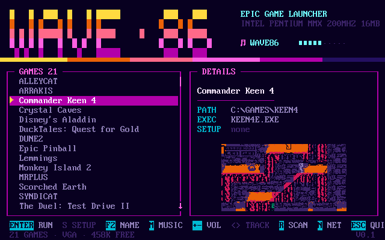

# WAVE86

A game launcher for MS-DOS with a synthwave look and its own soundtrack.

It is a plain 16-bit real-mode program, so it runs on anything from an
XT to a 486 and beyond. I build it on a Mac with Open Watcom and try it
in dosbox-x before it goes onto the real machine.

## What it does

- Lists the games in `C:\GAMES` (one folder per game), works out which
  file starts each one and finds the setup program if there is one.
- Runs a game with all of conventional memory free. The launcher does not
  stay resident under the game: it writes a small batch file and quits,
  and `WAVE.BAT` runs the game and brings the menu back afterwards.
- Plays music while you browse: AdLib tunes in id Software's IMF format
  and ProTracker MODs through a Sound Blaster. It starts silent, `M`
  turns it on. The header shows a VU meter, which becomes the volume bar
  while you adjust it.
- VGA gets a custom palette. EGA, CGA and mono cards get the standard
  colours and the layout still holds up.
- Tells you what it is running on. The header line comes from CPUID and
  a clock measurement (exact via RDTSC on Pentium-class CPUs, estimated
  from a timed loop and marked with `~` on 486s and older) plus the
  BIOS memory count, so a K6-2 shows up as `AMD-K6 3D 400MHZ 64MB` and a
  DX2 as `80486 ~66MHZ 8MB`.

## Keys

| Key | Does |
| --- | --- |
| Up/Down, PgUp/PgDn, Home/End | move (a letter jumps to the next game starting with it) |
| Enter | run the game |
| S | run its setup program |
| F2 | rename the selected game (saved to the INI) |
| M | music on/off |
| + / - | volume |
| < / > | previous / next track |
| R | rescan the games folder |
| N | the games on the server (Enter downloads, L refreshes) |
| Esc | back to DOS |

## Putting it on the DOS machine

Copy these into a folder on the DOS box, say `C:\WAVE86`:

    build\WAVE86.EXE   WAVE.BAT   WAVE86.INI   MUSIC\   THUMBS\
    (and for downloads: WAVEGET.EXE  DHCP.EXE  MTCP.CFG)

Put each game in its own folder under `C:\GAMES` (or change `gamedir=`
in the INI). Add `C:\WAVE86` to your PATH and type `WAVE`. To boot
straight into the menu, put `CALL C:\WAVE86\WAVE.BAT` at the end of
`AUTOEXEC.BAT`.

Start it with `WAVE`, not `WAVE86.EXE`. Both work, but only the batch
file hands the game every byte of memory; the bare EXE keeps itself
resident and runs the game from there.

When something looks wrong, `WAVE86 /diag` prints what it found: DOS
version, free memory, video card, the AdLib test, `BLASTER`, DSP version,
CPU, and how many tunes it sees. `WAVE86 /launch KEEN4` starts a game
directly, which is handy for a boot-into-game AUTOEXEC.

## WAVE86.INI

Lives next to the EXE. Example:

    gamedir=C:\GAMES
    music=0          ; 1 = play at startup
    ; adlib=1        ; force FM on (0 = off); normally auto-detected
    ; modrate=11025  ; MOD mixer rate; 0 turns MODs off

    [KEEN4]
    name=Commander Keen 4

    [XCOM]
    name=UFO: Enemy Unknown
    exe=UFO.BAT

Section names are game folder names. The launcher adds a section for
every new folder it finds, so the file always lists your collection;
press `F2` in the menu to give a game a proper name (or run
`WAVE86 /name KEEN4 Commander Keen 4` from the prompt). Per game you can
set `name`, `exe`, `setup`, `args`, `cd` and `hide=1`; `source=exodos` or
`source=tdc` (set by the launcher after a download) shows where the game
came from in the details. Anything you leave out is detected: the launcher prefers an EXE named like the folder, then
`START`/`PLAY`/`GO` batch files, and ignores the usual `SETUP`,
`INSTALL`, `DOS4GW` and friends.

### Per-game setup: PicoGUS modes, environment, extra commands

A game's section can also carry things that go into the batch file
around the game:

    [DOOM]
    sound=gus
    env=ULTRASND=240,1,1,5,5
    pre=C:\UTILS\SLOWDOWN.EXE
    post=C:\UTILS\SLOWDOWN.EXE /off

`env=` becomes a `SET`, `pre=` runs before the game and `post=` after
it. `sound=` names a mode; the command for each mode is defined once at
the top of the INI, and `sound=` up there is the default for games that
don't say:

    soundcmd_sb=C:\PICOGUS\PGUSINIT.EXE /mode sb
    soundcmd_gus=C:\PICOGUS\PGUSINIT.EXE /mode gus
    sound=sb

With that, a PicoGUS switches to GUS for Doom and back to Sound Blaster
for everything else, on every launch, whether you start from the menu
or with `WAVE86 /launch DOOM`. The details pane shows the mode.

## Music

Everything in `MUSIC\` next to the EXE is the playlist.

**IMF** is the AdLib format id Software used in Commander Keen and
Wolfenstein 3D: a stream of OPL2 register writes with delays. `.IMF`
plays at 560 Hz, `.WLF` at Wolf3D's 700 Hz, and both the raw and the
length-header variants are fine. Tunes up to 240 KB are loaded into far
memory and freed before any game runs. It plays on an AdLib or on the FM
side of any Sound Blaster.

**MOD** is 4-channel ProTracker (`M.K.`, `M!K!`, `4CHN`, `FLT4`), mixed
in software and pushed through the Sound Blaster's DMA. The mixer picks
its rate from the CPU: 22 kHz on a 386 or better, 11 kHz on a 286, and
on an 8086 MODs are skipped. The usual effects are there (arpeggio,
portamento, vibrato, offset, volume slides, jumps and breaks, pattern
loop, fine slides, retrigger, cut, delay, speed and tempo). FastTracker
XM is not supported; OpenMPT can export a 4-channel XM to MOD.

The four synthwave tracks and `WAVE86.MOD` are generated by
`tools/makemusic.py` and `tools/makemod.py` (`make music` rebuilds them).
They are the only tunes in the repo. Anything else you drop into
`music/` gets copied into the build but stays out of git, since scene
tunes belong to their authors.

To use AdLib music from the demoscene, build `tools/scene2imf` (needs
`brew install adplug`). It plays a RAD, D00, HSC, A2M, SA2 or CFF file
through libadplug and records the register writes as an IMF:

    c++ -O2 -std=c++17 -I/opt/homebrew/include -I/opt/homebrew/include/libbinio \
        -L/opt/homebrew/lib -ladplug -lbinio -o tools/scene2imf tools/scene2imf.cpp
    tools/scene2imf ~/Downloads/tune.rad music/TUNE.IMF

Keep to 8.3 filenames. `tools/imf2wav` renders an IMF to WAV so you can
listen on the Mac.

### Sound cards

Detection is the classic AdLib timer test, but it waits up to 30 ms for
the flag because emulated cards such as the PicoGUS raise it late. If a
Sound Blaster DSP answers, FM is assumed present anyway, since every SB
has one. `adlib=` and `modrate=` in the INI override all of this.

## Building

You need Open Watcom V2 in `toolchain/` (it is not in git). Download
`ow-snapshot.tar.xz` from the `Current-build` release of
github.com/open-watcom/open-watcom-v2 and extract `armo64` (the macOS
ARM host tools), `h` and `lib286` into `toolchain/`. On an Intel Mac use
`bino64` instead and adjust the path at the top of the Makefile.

    make          builds build/WAVE86.EXE and copies WAVE.BAT, the INI and MUSIC\
    make run      opens it in dosbox-x, with sound and networking (see below)
    make test     renders the UI headlessly to build/screen.png
    make music    regenerates the soundtrack
    make clean

The code is compiled for the 8086 instruction set with the small memory
model, and comes out around 40 KB.

## Screenshots in the details pane

A game with a `THUMBS\<DIR>.THM` next to the EXE shows a small
screenshot under its details. It is still text mode: a VGA's character
shapes live in RAM, and in 512-character mode bit 3 of the attribute
picks one of two fonts. The second font starts as a copy of the first,
so the bright UI text is unchanged, and both banks lend the CP437 codes
the UI never uses, about 280 glyphs. The picture is 26 by 7 cells
(close to 4:3 on a CRT), each cell two palette colours plus a 1-bit
pattern loaded as a custom glyph; flat cells and cells that look like
standard block characters borrow those, and busy pictures get
near-identical patterns merged until they fit. VGA only.

    python3 tools/makethumb.py screenshot.png THUMBS/KEEN4.THM    # needs ffmpeg

## Games from eXoDOS or the Total DOS Collection over the network

Press `N` in the menu and the launcher shows the games in your
collection, served from a machine on the LAN; Enter downloads one
straight into `C:\GAMES` and it appears in the games list, named and
with its executable set. Nothing is unzipped on the DOS side: the server
streams plain files.

On the machine with the collection (Mac, Linux, a NAS with Python):

    python3 tools/waveserve.py ~/Downloads/eXoDOS --port 8086 --cd
    python3 tools/waveserve.py --tdc ~/Downloads/1981-1992 --port 8086
    python3 tools/waveserve.py ~/Downloads/eXoDOS --tdc ~/Downloads/TDC --port 8086

For eXoDOS it indexes the game zips, reads each game's `dosbox.conf`
for the program that starts it and takes genre and description from the
platform XML. `--cd` includes the CD games: the server turns the cue/bin
in the zip into a plain ISO while it streams (the 2048 data bytes of
each sector, cut at the volume size; audio tracks are dropped), so
Syndicate Plus arrives as its files plus `CD\SYNDICAT.ISO`, and the
menu marks such games "CD IMAGE".

The Total DOS Collection is plain folders, `1992/Title (1992)(Publisher)
[Genre]/`, one game each, so there is no manifest to read: the title,
year, publisher and genre come from the folder name, and the launcher
works out the executable once the files are on disk. The details pane
says which collection a game is from, and the games list tags downloaded
games with eXoDOS or TDC. Both serve from one port; the server addresses
TDC games as `tdc:DIR`.

A collection that is still coming in over BitTorrent is handled: folders
with nothing downloaded yet are left out, and a game whose files are
partly placeholders (0 bytes, dated the day the torrent started) is
listed as "INCOMPLETE" and shipped without them. If what arrives has
nothing to run, the launcher says so on the status line instead of
listing an empty folder. The server re-indexes every five minutes.

On the DOS machine, copy `WAVEGET.EXE`, `DHCP.EXE` and `MTCP.CFG` from
`build/` next to the launcher, put the server's address in the INI:

    server=192.168.1.109:8086

and get the network card up in `AUTOEXEC.BAT` (PicoMem or any NE2000):

    NE2000 0x60 5 0x300
    SET MTCPCFG=C:\WAVE86\MTCP.CFG
    C:\WAVE86\DHCP

`make run` does all of this inside dosbox-x: it turns on the NE2000
emulation (slirp backend), loads the packet driver from `Z:\SYSTEM`,
runs DHCP and points the launcher at `10.0.2.2:8086`, which is the Mac
as the emulator sees it, through the `WAVESRV` environment variable
(it overrides `server=`). Start `waveserve.py` first.

`NE2000.COM` in `net/` is the Crynwr packet driver (GPL) for the card,
the same one dosbox-x carries on its Z:. `WAVEGET.EXE` is a separate program built on mTCP (GPL v3, sources in
`net/`), so the launcher itself stays a small 8086 program with no
network code; downloads run through the same batch hand-off as games,
with all memory free. Esc aborts a download. The list is read from disk
as you scroll, with only a table of line offsets in memory, so a
collection of 16,000 games fits in 64 KB; a letter key jumps through the
titles starting with it. The server addresses games by folder name, so
a list that is a few minutes old still fetches the right one.

## CD images

A game with an ISO in its `CD\` folder (or `cd=` in its INI section)
gets the image mounted as D: for as long as it runs. The lines go into
the same batch file as the game, so it works from the menu and from
`WAVE86 /launch`:

    SHSUCDHD /F:C:\GAMES\SYNDICAT\CD\SYNDICAT.ISO /Q
    SHSUCDX /D:SHSU-CDH,D /Q
    call RUN.BAT
    SHSUCDX /U /Q
    SHSUCDHD /U /Q

On real DOS that is Jason Hood's SHSUCDHD (an image file as a CD-ROM
device) and SHSUCDX (his small MSCDEX replacement), built from his
sources into `cdrom/` and copied next to the launcher by `make`. They
load before the game and unload after it, so nothing stays resident.
Under DOSBox the launcher uses `IMGMOUNT D image -t iso` instead; it
knows it is in DOSBox by the Z: drive. `cdmount=` and `cdunmount=` in
the INI replace either, with `$ISO` standing for the image path.

The disc lands on D: because that is where eXoDOS mounts it and games
like Syndicate Plus have `D:` written into their start batch. If a real
CD-ROM already owns D: with MSCDEX loaded, SHSUCDX refuses to install
beside it: either let SHSUCDX drive the real drive too (`SHSUCDX
/D:MSCD001` in AUTOEXEC.BAT instead of MSCDEX, giving the image its
letter after that) or add `/I` through a `cdmount=` line.

## Testing without a DOS machine

`WAVE86 /dump [DIR]` draws the menu with DIR selected (`/dump NET [DIR]`
draws the network view), then dumps the text buffer, the BIOS font and the palette; `tools/rendscr.py` turns that into a PNG. That is
how the screenshot above was made. `WAVE86 /mustest [seconds]` plays
headlessly and reports where the player got to; with a MOD it also
writes the mixer output to `MODDUMP.RAW`, which I compared against
libopenmpt to check the mixer. All of this runs under
`SDL_VIDEODRIVER=dummy dosbox-x -nogui`.

One thing to know: dosbox-x hangs after about ten `-c` commands, so
longer test sequences go into a DOS batch file and get started with a
single `call`.

### On a real DOS kernel

DOSBox's shell is not DOS: it has no device driver chain, keeps every
drive letter for itself and answers INT 21h its own way, so things like
the CD drivers can only be checked against a real kernel. `make dostest`
boots one in dosbox-x: it builds a hard-disk image with the launcher and
`GAMES\`, boots `dos/FREEDOS.IMG` (a FreeDOS 1.3 floppy stripped to the
kernel and shell, see `dos/README.md`), runs `tools/dostest.py`'s smoke
test and prints the results. The smoke test runs `WAVE86 /diag`, and for
the first game with a CD image loads SHSUCDHD and SHSUCDX, lists D: and
checks the batch the launcher generates. About half a minute.

    make dostest                                   FreeDOS
    make dostest DOS=~/Downloads/dos/Disk1.img     MS-DOS 6.22, from its setup disk 1
    make dosrun                                    the same, on screen, booting into WAVE.BAT
    python3 tools/dostest.py --game SYNDICAT --script mytest.bat

`make dosrun` is `make run` on a real kernel: the window boots DOS, loads
the packet driver and DHCP, and starts the launcher with sound and the
network view working against a waveserve on this machine. Games you
download there land inside `build/dosrun/hd.img`, not in `GAMES\`.

Any bootable 1.44 MB floppy image works as `DOS=`; the first setup disk
of MS-DOS 5 or 6 is a plain boot disk once the harness replaces its
AUTOEXEC. Keep those outside the repo. Your own test batch runs on C:
with the launcher in `C:\WAVE86` and the games in `C:\GAMES`; whatever
it writes to `C:\RESULTS` is printed, and `FAIL.TXT` there fails the
run. `tools/nettest.bat` is one such batch: the packet driver, DHCP and a
list fetch from a waveserve here, the chain the 486 uses. Needs mtools
(`brew install mtools`).

## Layout

    src/wave86.c   main loop, RUNGAME.BAT, command line flags
    src/ui.c       the screen: direct video memory, CP437, VU meter
    src/vga.c      card detection, palette, screen dump
    src/scan.c     finding games and their executables
    src/ini.c      WAVE86.INI
    src/music.c    AdLib detection, IMF player, playlist, volume
    src/mod.c      Sound Blaster DMA, ProTracker loader, sequencer, mixer
    src/cpu.c      CPU and memory identification for the header line
    src/net.c      the server's game list, download bookkeeping
    net/           WAVEGET.CPP, MTCP.CFG, mTCP's library and DHCP (GPL)
    cdrom/         SHSUCDHD and SHSUCDX, the CD image drivers for real DOS
    dos/           FreeDOS boot floppy for make dostest
    tools/         composers, converters, renderers (host side)
    music/         the soundtrack
    docs/          screenshot

## Later

- Network support through a PicoMem card's NE2000, so the launcher can
  pull games and lists from a machine on the LAN. That is where this is
  heading.
- Leaving CD images on the server: Michael Brutman's mTCP NetDrive
  mounts a remote disk image as a drive, and SHSUCDHD reads an ISO from
  it with no measurable overhead, so the 60 MB need not sit on the DOS
  disk at all.
- XM playback, if the 486 can take it.
- Joystick navigation, 50-line mode, a wider list for big collections.
