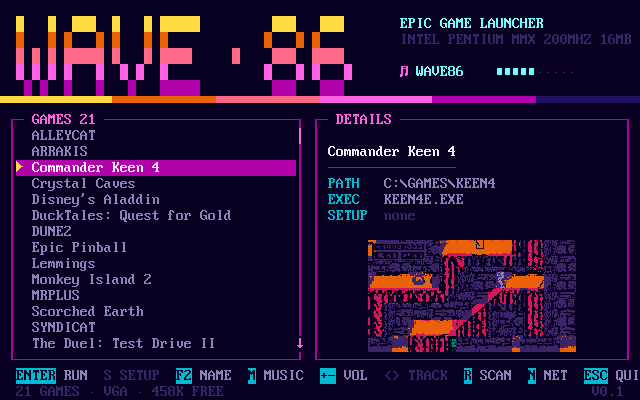

# WAVE86

A game launcher for MS-DOS that can fetch its games from an eXoDOS
collection on your LAN, or play them straight off it, with a look of
its own and its own soundtrack.

It is a plain 16-bit real-mode program, so it runs on anything from an
XT to a 486 and beyond. I build it on a Mac with Open Watcom and try it
in dosbox-x, and on a real DOS booted in dosbox-x, before it goes onto
the real machine, a Pentium III with a PicoMem 2. Version 0.5: the
server can read the eXoDOS torrent itself and fetch only what it serves;
a game comes with its picture; M opens a menu of everything, O sets a
game's CPU speed and memory limit; and `make picomem-image` writes a
ready-made disk for the card, on FreeDOS, EDR-DOS or a DOS of your own.

## What it does

- Lists the games in `C:\GAMES` (one folder per game), works out which
  file starts each one and finds the setup program if there is one.
- Runs a game with all of conventional memory free. The launcher does not
  stay resident under the game: it writes a small batch file and quits,
  and `WAVE.BAT` runs the game and brings the menu back afterwards.
- Plays music while you browse: AdLib tunes in id Software's IMF format
  and ProTracker MODs through a Sound Blaster. It starts silent, `M`
  turns it on. The header shows a VU meter, which becomes the volume bar
  while you adjust it.
- VGA gets a custom palette. EGA, CGA and mono cards get the standard
  colours and the layout still holds up. The default look is the eXoDOS
  one: a block-letter logo in the colours of the eXoDOS icon (violet, a
  red D, an orange S) with a drop shadow and matching DOS colours;
  `theme=wave86` in the INI brings back the synthwave look, and
  `theme=picomem` is black and gold with the PicoMEM card's elephant,
  after its Black Gold edition; the PicoMem disk image boots into it.
- Tells you what it is running on. The header line comes from CPUID and
  a clock measurement (exact via RDTSC on Pentium-class CPUs, estimated
  from a timed loop and marked with `~` on 486s and older) plus the
  BIOS memory count, so a K6-2 shows up as `AMD-K6 3D 400MHZ 64MB` and a
  DX2 as `80486 ~66MHZ 8MB`.

## Keys

| Key | Does |
| --- | --- |
| Up/Down, Home/End | move (a letter jumps to the next game starting with it) |
| Left/Right, PgUp/PgDn | turn the page: the list moves 14 titles, the bar stays on its row |
| / | search: type a few letters, Enter goes to the next title with them in it, anywhere in it; F3 (or / and Enter) searches on |
| Enter | run the game |
| Del | remove the game: its folder and everything in it, after a yes (a disc kept on `cdrom_storage=` stays) |
| P | the details (path, program, setup, tags) instead of the picture, and back; only in the menu, not on the key bar |
| O | the game's options: CPU slowdown, memory limit, sound mode, written to its INI section (below) |
| S | run its setup program |
| F2 | rename the selected game (saved to the INI) |
| M or ? | a menu of everything the view does, each with its key, over the bottom of the screen: the arrows and Enter pick one, or the key itself does (music on/off is in there: M, then M) |
| + / - | volume |
| < / > | previous / next track |
| R | rescan the games folder |
| N | the games on the server: Space puts the game under the bar in the install queue (or takes it out), Enter (or I) fetches the queue - or, with nothing queued, installs the game under the bar - P plays it off the server, Q shows the queue in a box (Enter there fetches it too, Del takes one out), / or S finds a title; and in the menu (M): L refreshes the list, C picks the disc with the game or on the server, U updates WAVE86 itself |
| Esc | back to DOS |

## Putting it on the DOS machine

Copy these into a folder on the DOS box, say `C:\WAVE86`:

    build\WAVE86.EXE   WAVE.BAT   WAVE86.INI   MUSIC\   THUMBS\
    (and for downloads: WAVEGET.EXE  DHCP.EXE  MTCP.CFG)

Put each game in its own folder under `C:\GAMES` (or change `gamedir=`
in the INI). Add `C:\WAVE86` to your PATH and type `WAVE`. To boot
straight into the menu, put `CALL C:\WAVE86\WAVE.BAT` at the end of
`AUTOEXEC.BAT`.

Start it with `WAVE`, not `WAVE86.EXE`. Both work, but only the batch
file hands the game every byte of memory; the bare EXE keeps itself
resident and runs the game from there.

When something looks wrong, `WAVE86 /diag` prints what it found: DOS
version, free memory, video card, the AdLib test, `BLASTER`, DSP version,
CPU, and how many tunes it sees. `WAVE86 /launch KEEN4` starts a game
directly, which is handy for a boot-into-game AUTOEXEC.

### A ready-made disk for a PicoMem 2

`make picomem-image` builds `build/pmwave-fdos.img`, a 512 MB hard-disk
image (volume label `PM_WAVE`) that boots FreeDOS straight into the
launcher on a machine with a PicoMem 2 - or, below, the same image on
EDR-DOS or on a DOS of your own, named after what it runs: copy it into the `HDD` folder of the card's SD card, pick it
as HDD0 in the card's BIOS Setup (S at its "Press S for Setup" prompt;
Disk menu, with PicoMEM Boot Code on), and make `EXODOS` and `CDROM`
folders on the SD's root for the games and the discs. On the image:

    C:\WAVE86      the launcher as make dist packs it, with an INI for this machine and the MTCP.CFG that DHCP writes to
    C:\PICOMEM     the card's DOS tools (PMINIT, PMDFS, PM2000, NE2000, PMMOUSE...) and CDMKE.SYS
    C:\MTCP        Michael Brutman's mTCP client programs (FTP, Telnet, Ping, HTGet...)
    C:\ULTRASND    the Gravis UltraSound software (ULTRASND.INI, ULTRINIT, ULTRAMID, the patches)
    C:\DOS         FreeDOS utilities: EDIT, MEM, MORE, XCOPY, DELTREE, ATTRIB, FIND, TREE, LABEL
    C:\4DOS        4DOS 8.00, the shell, with its help (4HELP, or F1 at the prompt), its
                   licence, and a 4DOS.INI that puts it in upper memory

CONFIG.SYS shows a menu for five seconds, then takes 1: 1 loads JEMMEX
(`DOS=HIGH,UMB`, with `X=D000-D7FF` keeping its upper memory off the
card's own BIOS and RAM window and the 8 KB after it), 2 loads JEMMEX
with `NOEMS NOHI NOINVLPG X=A000-FFFF` and 4DOS neither swapping nor
loading high, 3 loads no memory manager at all and FreeCOM as the shell;
2 and 3 exist for finding out what a JemmEx exception or a hang on the
card is about, one piece at a time. Then NetDrive's driver (in upper
memory under 1),
and `CDMKE.SYS /D:MSCD000 /P:250 /Q`, the Panasonic/MKE driver for the
card's emulated CD-ROM; the shell is 4DOS 8.00 - the same one as on an
MS-DOS machine set up with it, so batch files and habits carry over,
and most of what feels different about FreeDOS is FreeCOM's, not the
kernel's - with 2048 bytes of environment, itself, its environment,
aliases and history in upper memory, and FreeDOS's COMMAND.COM left in
the root as a fallback (the CONFIG.SYS comment has the line).
AUTOEXEC.BAT sets `BLASTER=A220 I5 D1 T3`, `ULTRASND=240,1,1,5,5` and
`ULTRADIR` (the last two only while `C:\ULTRASND\ULTRASND.INI` exists),
runs `PMINIT /SB 1 /GUS 1 /MPU 1` in one call (its source loops over the
switches), mounts the SD card as W: with `PMDFS S-W`, gives the CD-ROM D:
through SHSUCDX, loads CuteMouse, the NE2000 packet driver (IRQ 3, port
300, the card's defaults) and `DHCP -retries 2 -timeout 10` (twenty
seconds at most with the Wi-Fi down; Esc skips it), and ends in
`CALL WAVE.BAT`. WAVE86.INI has `gamedir=W:\EXODOS`,
`cdrom_storage=W:\CDROM`, `imgmount=PICOMEM` and `cdrom_letter=D`;
`server=` is yours to fill in. Every card step is behind `IF EXIST`, and
the numbers (IRQs, port, packet interrupt) are `SET` lines at the top of
the batch, so a different jumper is a one-line edit.

Discs: `imgmount=PICOMEM` with no `cdmount_picomem=` command, since
the PicoMem 2 has no DOS command to hand it an image yet: the discs go
to `W:\CDROM` as cue/bin, and when a game needs its disc the batch
names it - `PLEASE LOAD SETTLR2G.CUE ON YOUR PICOMEM NOW` - and waits
for a key while you pick it on the card, then goes on with the disc on
D: (CDMKE.SYS and the boot-time `SHCDX86 /D:?MSCD000,D` line give the
card's drive that letter once the firmware has one). When the card gets
a load command, `cdmount_picomem=` in the INI is the switch and the
prompt goes away.

The pieces are in the repository, under `third-party/` (its README
says what is where; `THIRD-PARTY.md` whose it is), because retro
download sites come and go: the PicoMEM D6 release package and the
card repository's `drivers/` folder, whole (C:\PICOMEM is the package's
PICOMEM folder plus the packet driver; `PICOMEM_DIR=` uses a folder of
your own), mTCP's client zip (`MTCP_TOOLS=` for your own), CDMKE.SYS,
the PicoGUS project's copy (`CDMKE_DIR=` empty leaves it out, and the
CONFIG.SYS line becomes a comment), the Gravis UltraSound software, the
`ultrasnd.zip` in that `drivers/` folder (`GUS_DIR=` empty leaves it out, then C:\ULTRASND is
empty and the GUS lines stay off; `GUS_DIR=` also takes an unzipped copy
of your own), the FreeDOS utilities as the 1.3 packages from ibiblio
(`DOS_PKGS=` is the list, `DOS_DIR=` a folder of your own, `DOS_DIR=`
empty leaves C:\DOS out), and 4DOS 8.00 as the official package, with
its LICENSE.TXT, which its licence says must travel with it
(`FOURDOS_DIR=` empty keeps FreeCOM as the shell). The Makefile unpacks
each into `build/` on first use. `make update-third-party` (or
`update-mtcp`, `update-picomem`, `update-gus`... one at a time) fetches
them afresh from where they came, says what changed, and leaves them for
you to commit; `make check-third-party`, which CI runs, says whether
every file is the one recorded in `third-party/SOURCES.txt`. `IMAGE=`
and `IMAGE_MB=` change the file and its size; the work files stay in
`build/<name>-work/` wherever the image goes, so
`IMAGE=/Volumes/SD/HDD/PMWAVE.IMG` writes nothing else to the card. A
folder given by hand that does not exist fails before anything is built.

#### Other kernels, and a DOS of your own

The tooling on the image - WAVE86, the card's programs, mTCP, 4DOS, the
cache - does not care which DOS is under it, so the builder takes three:

- `make picomem-image` - the FreeDOS kernel, as above: `pmwave-fdos.img`.
- `make picomem-image KERNEL=edrdos` - the EDR-DOS kernel (Enhanced
  DR-DOS, the one SvarDOS boots), a drop-in for KERNEL.SYS under the same
  boot sector, from its release zip in `third-party/edrdos` (`EDR_VER=`,
  `EDR_DIR=` for a folder of your own): `pmwave-edrdos.img`. Its licence
  is a grey area - a 2022 grant from DRDOS, Inc. in the repository,
  Caldera's 1997 non-commercial terms still in the tree - fine for this
  repo, not for anything commercial. Reports itself as DR DOS 7.01; 4DOS
  runs on it.
- `make picomem-image DOS_DISKS="~/dos/Disk1.img ~/dos/Disk2.img"` - your
  own licensed DOS, from its setup floppies (the bootable one first, with
  SYS.COM and EXPAND.EXE on it). Nothing of it enters the repo: the builder
  copies the boot floppy, adds the packed tools from the other disks, gives
  the copy an AUTOEXEC.BAT that runs `SYS C:` and EXPANDs the tools into
  `C:\DOS`, and boots that copy in dosbox-x with the empty partition as C:.
  So that DOS writes its own boot sector and system files, the only way
  that works for MS-DOS (its boot sector wants IO.SYS in the first
  directory entry); then the rest of the tree goes on with mtools, which
  leaves what is there alone. CONFIG.SYS gets DOS 6's own `[menu]` with
  the same three kinds of setup - `HIMEM.SYS` and `EMM386.EXE RAM
  X=D000-D7FF`, HIMEM alone, or neither - instead of JEMMEX, AUTOEXEC.BAT `SMARTDRV
  /X 8192` as its cache (the FreeDOS image has none: LBACACHE was tried
  and taken out), its DBLSPACE.BIN or DRVSPACE.BIN taken off the root so
  IO.SYS loads no DoubleSpace driver, and WAVE86.INI `slowcache=0`, since
  MS-DOS 6.22's memory managers crash when SLOWDOWN touches the CPU
  cache. Named after the disks: `pmwave-msdos.img` for IO.SYS,
  `pmwave-pcdos.img` for IBMBIO.COM. Built and boot-tested here with
  MS-DOS 6.22's three setup disks (29 tools into C:\DOS, 4DOS as the
  shell, `MS-DOS 6.22` under it); PC DOS follows the same route but has
  not been tried. The disks are only ever read.

The image is shaped the way the card reads disks: its BIOS is DOSBox's
INT 13h, CHS only, assuming 16 heads and 63 sectors and shifting to 32
heads above 1024 cylinders, so 512 MB is 520 x 32 x 63 and dosbox-x's
IMGMAKE is asked for exactly that; the MBR and BPB are checked against
what the card will report before anything is written. IMGMAKE leaves no
boot code, so the FreeDOS FAT16 boot sector (`dos/FAT16.BS`, from the
kernel's own `boot/boot.asm`) goes over the partition's, keeping
IMGMAKE's BPB, as SYS.COM does; the kernel and shell are the ones on
`dos/FREEDOS.IMG`, and `tools/fat16.py` writes the tree. The INI is the
shipped WAVE86.INI with those keys set in place (a live key replaced, a
commented-out example brought to life; the comments stay, and the build
prints each line it changed). Then the self-test: a copy of the image
boots in dosbox-x, headless, from the hard disk (no floppy), with the
launcher's WAVE.BAT swapped for a stub that records `ver`, `set`,
`WAVE86 /diag` and what the PMINIT line expands to. The build passes
only if the image's own CONFIG.SYS and AUTOEXEC.BAT get that far, with
XMS from JEMMEX, the 2048-byte environment, PATH, MTCPCFG and BLASTER
in place, ULTRASND and ULTRADIR set together and `/GUS 1` on the PMINIT
line exactly when the Gravis files are there - once as dosbox-x boots
it (LBA) and once with the boot sector forced to CHS, the card's path.
That second run patches one byte of the FreeDOS boot sector (EDR-DOS
boots under the same one); an image SYS'd from `DOS_DISKS=` has that
DOS's own sector, which the patch does not know, so it boots once, the
LBA way, and the build says so. The PicoMem programs and DHCP find no
card in dosbox-x and give up, which is the point: the batch gets past
them. About a minute; the results stay in `build/<name>-work/`
(`build/pmwave-fdos-work/` for the default).

What dosbox-x cannot tell you, to check on the card itself:

- Whether the card's tools see the card at all: JEMMEX's `X=D000-D5FF`
  is meant to keep its UMBs off the card's window, and is the first
  thing to look at if PMINIT, PMDFS and PM2000 all fail at once (the
  window moves with a `BIOS` line in the SD's config.txt).
- The geometry. The 32-head shift is in the firmware source on `main`;
  if the card reports the disk wrong, `IMAGE_MB=500` gives 1015 x 16 x 63,
  which needs no shift.
- CD-ROM emulation is not in the PicoMem 2 firmware yet; whether the port
  stays 250 and the device MSCD000 when it ships is the wiki's word.
- PMDFS on FreeDOS: it is EtherDFS for DOS 4+, not tried on this kernel.
- The IRQs: the card's own on 7 (a jumper, mandatory in this firmware),
  Sound Blaster and GUS on 5 with DMA 1 (the other jumper), NE2000 on 3 -
  the card author's numbers. A card whose BIOS Setup still says another
  NE2000 IRQ leaves the packet driver deaf and DHCP waiting at every boot.
  Whether JEMMEX gets in the way of the card's Sound Blaster is not
  documented (the PicoMem 1 warning is about EMM386 and software DMA);
  `NOEMS` after `X=D000-D5FF` is the next thing to try, then no JEMMEX.
- Big writes through PMDFS, a redirector drive: `netwrite=512` in the
  INI if WAVEGET stumbles writing to W:.

## WAVE86.INI

Lives next to the EXE. The one that ships lists every setting the
launcher and WAVEGET read, one per line at its default, in alphabetical
order, with what it does in a comment above it - so the file is the
reference - and ends with one commented-out game section showing every
per-game property. A value runs to the end of its line, so comments go
on lines of their own:

    ; Where the games are, one folder each: a full path, or one relative to
    ; the launcher's folder.
    gamedir=C:\GAMES

    [KEEN4]
    name=Commander Keen 4

Section names are game folder names. The launcher adds a section for
every new folder it finds, so the file always lists your collection;
press `F2` in the menu to give a game a proper name (or run
`WAVE86 /name KEEN4 Commander Keen 4` from the prompt). Per game you can
set `name`, `exe`, `setup`, `args`, `cd` and `hide=1`; `source=exodos` or
`source=tdc` (set by the launcher after a download) shows where the game
came from in the details. Anything you leave out is detected: the launcher prefers an EXE named like the folder, then
`START`/`PLAY`/`GO` batch files, and ignores the usual `SETUP`,
`INSTALL`, `DOS4GW` and friends.

### Too fast, or too much memory

A 1.2 GHz machine is too fast for a game that paces itself by the CPU,
and 128 MB is too much for one that counts memory in a 16-bit register.
`O` on a game (also in the menu) opens its options: CPU SLOWDOWN - off,
Pentium 133, 486 DX2-66, 386 DX-33, 286 AT, XT - and MEMORY LIMIT - off,
4, 8, 12, 16, 24, 31 or 63 MB - plus the sound mode; Enter writes
`slowdown=` and `memlimit=` into the game's section, and Off removes
them. A value written into the INI by hand that no preset matches -
`slowdown=486:40`, `25%`, a `memlimit=` of 20 - shows as CUSTOM and is
left as it is, and Enter writes only the settings you changed. The
batch that runs the game then does, before it:

    C:\WAVE86\MEMLIM 24
    C:\WAVE86\SLOWDOWN.COM /Q /DisableHotKeys /MHz486:25

and after it `MEMLIM /FREE` and `SLOWDOWN /Q /Uninstall` - and those two
again at the top of every batch, so a game that crashed leaves nothing
behind for the next one. A folder without the programs changes nothing.

`MEMLIM` is ours (`src/memlim.c`, 8086 code): it takes extended memory
through XMS until the largest free block, and the total, are what the
game may see, keeps the handles in `MEMLIM.DAT` next to itself, and
`/FREE` gives them back. The interesting numbers: Aladdin compares
each XMS request against the largest free block with a signed 16-bit
jump, so anything from 32768 KB up fails it - 31 MB works, 36 does not;
eXoDOS runs it with `memsize=16`. `SLOWDOWN` is Bret Johnson's (freeware,
the COM and its DOC together, unmodified, in `third-party/slowdown` from
the FreeDOS package; `make update-slowdown` refreshes them, `make dist`
and `U` carry them to the DOS machine; its terms are in its DOC and in
THIRD-PARTY.md). Its eras are its own model of a 486's speed, not a
measurement of yours: `slow_486=` and friends in the global section
replace what an era means when the presets feel wrong, `slowcache=0`
keeps it off the CPU cache (MS-DOS 6.22's HIMEM/EMM386 crash when
anything touches it), and `slowint70=1` paces it off the real-time
clock instead of the timer tick, smoother but not for games that use
that interrupt themselves. A game that reprograms the timer can defeat
it; PC-speaker sound goes odd under any software slowdown.

Not every crash on a fast machine is a slowdown case. Lotus: The
Ultimate Challenge dies with a divide overflow in a speed-calibration
loop the game itself never uses; the fix is a two-byte patch to
`LOTUS.DAT` (`FB F7 F1` -> `FB 90 90`, once), after which it runs at
full speed - no slowdown reliably avoids the crash.

### Per-game setup: PicoGUS modes, environment, extra commands

A game's section can also carry things that go into the batch file
around the game:

    [DOOM]
    sound=gus
    env=ULTRASND=240,1,1,5,5
    pre=C:\UTILS\SLOWDOWN.EXE
    post=C:\UTILS\SLOWDOWN.EXE /off

`env=` becomes a `SET`, `pre=` runs before the game and `post=` after
it. `sound=` names a mode; the command for each mode is defined once at
the top of the INI, and `sound=` up there is the default for games that
don't say:

    soundcmd_sb=C:\PICOGUS\PGUSINIT.EXE /mode sb
    soundcmd_gus=C:\PICOGUS\PGUSINIT.EXE /mode gus
    sound=sb

With that, a PicoGUS switches to GUS for Doom and back to Sound Blaster
for everything else, on every launch, whether you start from the menu
or with `WAVE86 /launch DOOM`. The details pane shows the mode.

## Music

Everything in `MUSIC\` next to the EXE is the playlist.

**IMF** is the AdLib format id Software used in Commander Keen and
Wolfenstein 3D: a stream of OPL2 register writes with delays. `.IMF`
plays at 560 Hz, `.WLF` at Wolf3D's 700 Hz, and both the raw and the
length-header variants are fine. Tunes up to 240 KB are loaded into far
memory and freed before any game runs. It plays on an AdLib or on the FM
side of any Sound Blaster.

**MOD** is 4-channel ProTracker (`M.K.`, `M!K!`, `4CHN`, `FLT4`), mixed
in software and pushed through the Sound Blaster's DMA. The mixer picks
its rate from the CPU: 22 kHz on a 386 or better, 11 kHz on a 286, and
on an 8086 MODs are skipped. The usual effects are there (arpeggio,
portamento, vibrato, offset, volume slides, jumps and breaks, pattern
loop, fine slides, retrigger, cut, delay, speed and tempo). FastTracker
XM is not supported; OpenMPT can export a 4-channel XM to MOD.

The four synthwave tracks and `WAVE86.MOD` are generated by
`tools/makemusic.py` and `tools/makemod.py` (`make music` rebuilds them).
They are the only tunes in the repo. Anything else you drop into
`music/` gets copied into the build but stays out of git, since scene
tunes belong to their authors.

To use AdLib music from the demoscene, build `tools/scene2imf` (needs
`brew install adplug`). It plays a RAD, D00, HSC, A2M, SA2 or CFF file
through libadplug and records the register writes as an IMF:

    c++ -O2 -std=c++17 -I/opt/homebrew/include -I/opt/homebrew/include/libbinio \
        -L/opt/homebrew/lib -ladplug -lbinio -o tools/scene2imf tools/scene2imf.cpp
    tools/scene2imf ~/Downloads/tune.rad music/TUNE.IMF

Keep to 8.3 filenames. `tools/imf2wav` renders an IMF to WAV so you can
listen on the Mac.

### Sound cards

Detection is the classic AdLib timer test, but it waits up to 30 ms for
the flag because emulated cards such as the PicoGUS raise it late. If a
Sound Blaster DSP answers, FM is assumed present anyway, since every SB
has one. `adlib=` and `modrate=` in the INI override all of this.

## Building

You need Open Watcom V2 in `toolchain/` (it is not in git: 50 MB of
compilers). `make toolchain` fetches it - `ow-snapshot.tar.xz` from a
dated release of github.com/open-watcom/open-watcom-v2 (`OW_TAG=` in
the Makefile; CI uses the same one, so both build with the same
compiler) - and extracts the host tools for your machine (`armo64` on an
Apple silicon Mac, `bino64` on an Intel one, `binl64` on Linux) plus `h`
and `lib286`. By hand, the same three folders into `toolchain/` will do.

    make          builds build/WAVE86.EXE and copies WAVE.BAT, the INI and MUSIC\
    make run      opens it in dosbox-x, with sound and networking (see below), at
                  50000 cycles, a fast 486; CYCLES=3000 for an XT
    make waveserve  starts the game server on this machine, with its console
    make picomem-image  a bootable 512 MB FreeDOS disk for a PicoMem 2 (see above)
    make test     renders the UI headlessly to build/screen.png
    make dist     the DOS side as dist/wave86-<version>-dos.zip, ready to copy over
    make music    regenerates the soundtrack
    make clean

The Makefile picks the host tools for the machine it runs on (`armo64`,
`bino64` or `binl64` under `toolchain/`); the GitHub workflow in
`.github/workflows/build.yml` does the same on Linux and attaches the
zip to every build, and to a release for a tag like `v0.1`.

The code is compiled for the 8086 instruction set with the small memory
model, and comes out around 75 KB.

## Screenshots in the details pane

A game with a picture shows it in the details pane under its name and
nothing else; `P` swaps in the details (path, program, setup, tags) and
back. The picture is `THUMBS\<DIR>.THM` next to the EXE, or
one that came with the game from the server (below). It is still text
mode: a VGA's character shapes live in RAM, and in 512-character mode
bit 3 of the attribute picks one of two fonts. The second font starts
as a copy of the first, so the bright UI text is unchanged, and both
banks lend the CP437 codes the UI never uses, about 280 glyphs. A
picture is up to 36 by 10 cells (the ones the server makes; the launcher
shows whatever size the file says, centred), each cell two palette
colours plus a 1-bit pattern loaded as a custom glyph; flat cells and
cells that look like standard block characters borrow those, and busy
pictures get near-identical patterns merged until they fit - a 36 by 10
picture has 360 cells for those 280 glyphs, so it merges more than the
26 by 7 it started at. VGA only.

    python3 tools/makethumb.py screenshot.png THUMBS/KEEN4.THM --size 36x10    # needs ffmpeg

The cells are matched to a theme's colours, so a picture belongs to a
theme: `THUMBS\KEEN4.THM` is for the default look, `THUMBS\wave86\` holds
the ones made with `--theme wave86`, and the launcher looks in the
folder named after its theme first. The picomem look ships no set of
its own: a game installed from the server brings a picture made for
whichever theme the INI names.

### A picture with every game from the server

eXoDOS has artwork for nearly every game, named after its title: title
screens, gameplay shots, box art, logos. A game installed from the
server comes with one of them made into this picture, as
`THUMBS\<THEME>.THM` in the game's folder, which is the third place the
launcher looks. `netart=` in WAVE86.INI says which kind - `title` (the
title screen, the default), `gameplay`, `box`, `logo`, `disc`, `select`,
`over`, `back` or `3d` - and another kind stands in for a game that has
none of that one; `netart=0` fetches no picture. WAVEGET asks for it as
`?art=<kind>&theme=<name>&thumb=36x10`, so the picture is made for the
colours of the theme the INI names, at the size the launcher shows.

The server makes each picture once, from `Images/MS-DOS/` in the eXoDOS
folder (or from the metadata zip in the torrent, one piece per picture,
when there is no such folder), into `--thumbs DIR` (`~/wave86-thumbs`;
`--thumbs none` turns pictures off). It needs ffmpeg on the PATH; without
it the server says so once and sends none. A picture is 3 to 5 KB and
comes last in the pack.

## Games from eXoDOS or the Total DOS Collection over the network

Press `N` in the menu and the launcher shows the games in your
collection, served from a machine on the LAN; I installs one straight
into `C:\GAMES` and it appears in the games list, named and with its
executable set, and P plays it off the server without copying. Nothing is unzipped on the DOS side: the server
streams plain files. Del in the games list takes an installed game off the disk again.

On the machine with the collection (Mac, Linux, a NAS with Python):

    make waveserve
    make waveserve EXODOS=/Volumes/Games/eXoDOS PORT=8086
    make waveserve TDC=~/Downloads/TDC WAVESERVE_ARGS="--log serve.log"
    make waveserve TORRENT=eXoDOS.torrent

`make waveserve` builds first, since the server hands `build/` to WAVEGET
UPDATE, unpacks the NetDrive server for this machine from
`third-party/netdrive` if `build/netdrive` is not there yet, and starts
`tools/waveserve.py` with its console.
`q` in the console stops it and returns to the prompt.

The settings are in `waveserve.ini`, next to the Makefile: one per line,
alphabetical, with what it does in a comment above it, the way
`WAVE86.INI` does it; they are what the server starts with, and where
the bare command line falls back to something else without the file,
the comment says so - the collection (`exodos=`, `tdc=`,
`torrent=`), the port, whether CD games are listed, where the NetDrive
volumes, the torrent pieces and the pictures are kept, the torrent's
port, interface and upload limit (`torrent_upload=1024`, KB/s), and so on. A relative
path in it is taken from the repo. A variable to `make waveserve`
overrides a line for one run:

| variable | overrides |
| --- | --- |
| `EXODOS`, `TDC`, `TORRENT` | `exodos=`, `tdc=`, `torrent=` |
| `PORT`, `MAX_MB` | `port=`, `max_mb=` |
| `CACHE`, `NETDRIVE_DIR`, `THUMBS_DIR` | `cache=`, `netdrive=`, `thumbs=` |
| `WAVESERVE_ARGS` | anything else, such as `"--log serve.log"`, `--headless`, `--no-cd`, `--netdrive none` |

Run by hand, `tools/waveserve.py` reads the same file (`--config FILE`
for another, `--config none` for none), and every flag it takes is a
line in it; so the same thing is:

    python3 tools/waveserve.py ~/Downloads/eXoDOS --port 8086 --cd
    python3 tools/waveserve.py --tdc ~/Downloads/1981-1992 --port 8086
    python3 tools/waveserve.py ~/Downloads/eXoDOS --tdc ~/Downloads/TDC --port 8086

For eXoDOS it indexes the game zips, reads each game's `dosbox.conf`
for the program that starts it and takes genre and description from the
platform XML. `--cd` includes the CD games: the server turns the cue/bin
in the zip into a plain ISO while it streams (the 2048 data bytes of
each sector, cut at the volume size; audio tracks are dropped), so
Syndicate Plus arrives as its files plus `CD\SYNDICAT.ISO`, and the
menu marks such games "CD IMAGE".

The Total DOS Collection is plain folders, `1992/Title (1992)(Publisher)
[Genre]/`, one game each, so there is no manifest to read: the title,
year, publisher and genre come from the folder name, and the launcher
works out the executable once the files are on disk. The details pane
says which collection a game is from, and the games list tags downloaded
games with eXoDOS or TDC. Both serve from one port; the server addresses
TDC games as `tdc:DIR`.

A collection that is still coming in over BitTorrent is handled: folders
with nothing downloaded yet are left out, and a game whose files are
partly placeholders (0 bytes, dated the day the torrent started) is
listed as "INCOMPLETE" and shipped without them. If what arrives has
nothing to run, the launcher says so on the status line instead of
listing an empty folder. The server re-indexes every five minutes.

On the DOS machine, copy `WAVEGET.EXE`, `DHCP.EXE` and `MTCP.CFG` from
`build/` next to the launcher, put the server's address in the INI:

    server=192.168.1.10:8086

give COMMAND.COM a bigger environment in `CONFIG.SYS`, since DOS's
256-byte default runs out once `MTCPCFG` joins PATH and the sound
variables ("Out of environment space"):

    SHELL=C:\COMMAND.COM C:\ /E:1024 /P

and get the network card up in `AUTOEXEC.BAT` (PicoMem or any NE2000):

    LH NE2000 0x60 5 0x300
    SET MTCPCFG=C:\WAVE86\MTCP.CFG
    C:\WAVE86\DHCP

DHCP asks to be called `WAVE86`, which is the name the machine gets in
your router's list; `HOSTNAME` in `MTCP.CFG` is where to change it.

`LH` wants a memory manager providing upper memory (HIMEM plus EMM386,
or `dos\JEMMEX.EXE` with `DOS=HIGH,UMB`); without one it just loads
low. The CD drivers the launcher's batches load use `LH` too.

`make run` does all of this inside dosbox-x: it turns on the NE2000
emulation (slirp backend), loads the packet driver from `Z:\SYSTEM`,
runs DHCP and points the launcher at `10.0.2.2:8086`, which is the Mac
as the emulator sees it, through the `WAVESRV` environment variable
(it overrides `server=`). Start `waveserve.py` first.

`NE2000.COM` in `net/` is the Crynwr packet driver (GPL) for the card,
the same one dosbox-x carries on its Z:. `NETDRIVE.SYS` and
`NETDRIVE.EXE` are mTCP NetDrive's DOS side (GPL, source in
`net/mtcp/APPS/NETDRV`). `WAVEGET.EXE` is a separate program built on mTCP (GPL v3, sources in
`net/`), so the launcher itself stays a small 8086 program with no
network code; downloads run through the same batch hand-off as games,
with all memory free. Esc aborts a download. The list is read from disk
as you scroll, with only a table of line offsets in memory, so a
collection of 16,000 games fits in 64 KB; a letter key jumps through the
titles starting with it, and S (or /) searches for a title by any part of it -
the list file is read straight through for that, one seek and then
sequential, so 7,600 titles are searched before the key is back up. The
server addresses games by folder name, so
a list that is a few minutes old still fetches the right one.

## CD images

A game with an ISO in its `CD\` folder (or `cd=` in its INI section)
gets the image mounted as D: for as long as it runs. The lines go into
the same batch file as the game, so it works from the menu and from
`WAVE86 /launch`:

    SHSUCDHD /F:C:\GAMES\SYNDICAT\CD\SYNDICAT.ISO /Q
    SHSUCDX /D:SHSU-CDH,D /Q
    call RUN.BAT
    SHSUCDX /U /Q
    SHSUCDHD /U /Q

On real DOS that is Jason Hood's SHSUCDHD (an image file as a CD-ROM
device) and SHSUCDX (his small MSCDEX replacement), built from his
sources into `cdrom/` and copied next to the launcher by `make`. They
load before the game and unload after it, so nothing stays resident.
Under DOSBox the launcher uses `IMGMOUNT D image -t iso` instead; it
knows it is in DOSBox by the Z: drive. `cdmount=` and `cdunmount=` in
the INI replace either, with `$ISO` standing for the image path.

A CD game from the server comes with its own `IMGMOUNT.BAT`, and its
start batch calls it first, so the game also runs from a plain prompt
with the WAVE86 folder on the PATH. The batch reads two things from the
environment, which the launcher sets from the INI: `WAVECDROM`, the
folder holding the discs (`cdrom_storage=`; without it a game keeps its disc in
its own `CD\` folder, with it every disc goes there, named after the
game, `SETTLR2G.ISO`), and `IMGMOUNT`, how to mount them: `SOFTWARE`
(SHSUCDHD and SHSUCDX, the default) or the name of a card that emulates
a CD-ROM drive itself - `PICOGUS`, `PICOMEM` - which DOS sees as a real
drive with its letter fixed at boot (`cdrom_letter=`), the image loaded
by the card's own command, `cdmount_<mode>=` (and `cdunmount_<mode>=`).
The image is appended to that command, as its full path or, with
`cdrom_name=1`, as its bare file name.

A card that mounts images itself gets the discs as they came. The ISO
conversion keeps only the data track, and many of these games have their
music as CD audio: Settlers II Gold carries 328 MB of it and Warcraft II
more still. So when `imgmount=` names a card, the launcher asks the server
for `?cd=raw` and receives the cue sheet and its image untouched - renamed
to 8.3 after the game folder, `SETTLR2G.CUE` and `SETTLR2G.BIN`, with the
cue's `FILE` line rewritten to match - and the card gets the `.CUE`. In
software mode it still asks for `?cd=local`, the ISO, because SHSUCDHD
reads nothing else.

A PicoGUS with CD-ROM support reads its images from a drive, so put
them there and let PGUSINIT load them:

    cdrom_storage=W:
    imgmount=PICOGUS
    cdrom_letter=D
    cdmount_picogus=C:\PICOGUS\PGUSINIT.EXE /cdloadname

`PGUSINIT.EXE /cdloadname` is what PICOGUS runs when `cdmount_picogus=`
is not given - `/cdload` takes the number of an image, `/cdloadname` its
name. The card needs a moment before a disc it has just been handed can
be read, and a game that looks at once finds the drive empty, so the
batch waits for a key after loading the image (`cdrom_pause=0` skips it).
A game with `sound=` switches the card's mode just before, and `pgusinit
/mode` reloads its firmware, so an image handed over straight after is
refused; when the load command returns an error the batch says so and
waits for a key to try again.

The launcher writes a game's `IMGMOUNT.BAT` itself from these settings,
every time it starts that game, with the image path, the command and the
letter written in as they are. The server's version reads all of that
from the environment, which asks the shell for five `SET`s it may not
have room for and cannot know what card the machine has; this one needs
only `CD`, which the game's own batch reads. It also means a change in
the INI reaches a game that is already installed. A batch that fetches
its disc over NetDrive is left alone - that one needs the server's
address at run time - and so is anything not generated in the first
place. A PicoMem 2 is `cdrom_storage=W:\CDROM` (its SD card is W:
through PMDFS) and `imgmount=PICOMEM` with `cdmount_picomem=` left
empty: the card has no DOS command to hand it an image yet, so the
batch names the disc, asks you to load it on the card by hand and
waits for a key before it goes on; the discs collect under `W:\CDROM`
as cue and bin either way, and `cdmount_picomem=` is where the load
command goes once the firmware has one. Under DOSBox the batch uses
IMGMOUNT whatever the mode says; playing off the server always mounts
in software. The batch puts the letter the disc landed on into `CD`,
and the server rewrites the start batch to say `%CD%:` wherever the
eXoDOS conf said `D:`, so it does not matter if D: is taken by a real
CD-ROM or by NetDrive. When a game has `IMGMOUNT.BAT` the launcher
leaves the mounting to it and calls it with `/U` afterwards.

### CD images that stay on the server

A 300 MB disc does not have to travel to the DOS disk at all. With

    python3 tools/waveserve.py ~/Downloads/eXoDOS --port 8086 --cd --netdrive ~/wave86-cd

the server wraps each game's ISO in a FAT volume under `~/wave86-cd`
(built once, at index time) and runs Michael Brutman's mTCP NetDrive
server on UDP port 2002 to hand those volumes out. `make netdrive`
unpacks his official build of that server for this machine from
`third-party/netdrive` into `build/netdrive` (`make update-netdrive`
fetches a fresh one). On the DOS side the game's `IMGMOUNT.BAT` attaches
the volume as a drive with NetDrive, points SHSUCDHD at the ISO on it
and lets SHSUCDX give the disc a letter. Brutman measured this stack on
a 386DX-40 at the same speed as NetDrive alone, around 370 KB/s.

What the DOS machine needs for that:

    DEVICE=C:\WAVE86\NETDRIVE.SYS -d:2   in CONFIG.SYS (LASTDRIVE=Z too)
    DRVOFF D:                            first thing in AUTOEXEC.BAT
    PACKETINT 0x60, 0x65                 in MTCP.CFG (the second interrupt
                                         is for DHCP and WAVEGET while
                                         NetDrive holds the first); MTU 1500

The two lines are about the letter. DOS hands a block device driver the
next free letter, so `NETDRIVE.SYS` lands on D:, exactly where the games
want their disc, and no driver can ask for another letter. The way out
(DivByZero's, from the NetDrive thread on VOGONS) is to let NetDrive
reserve two letters and take the first out of use again: `DRVOFF`
(`net/DRVOFF.C`, a dozen lines against DOS's drive table) marks D:
invalid, so SHSUCDX can give the disc D: while NetDrive works on E:.
The game's `IMGMOUNT.BAT` finds NetDrive's letter by itself; `netdrive=`
in the INI names it if that guess is wrong. The launcher passes the
server's address in `WAVENDSRV` (the machine of `server=`, port 2002 or
`netdrive_port=`). The network view marks such games "NET CD".

There is no CD audio either way: SHSUCDHD serves data tracks only and the
server drops the audio tracks when it makes the ISO. What the ISO route
keeps is a real CD-ROM drive as far as the game can tell.

### Playing off the server

With NetDrive set up, P in the network view plays a game without copying
anything (Enter or I installs it instead): the server builds a disk
image of the whole game on first request (its files, its batches, the
disc under `CD\`, kept in the same folder as the CD volumes), the DOS
side attaches it as a drive, runs the game from there and detaches it
afterwards. `WAVE86 /play SYNDICAT` does the same from the prompt, given
a fetched list. The image is session scoped, NetDrive's term for a
private write journal per connection that is thrown away when the
session ends: any number of machines can play from one image, and a game
can save as it likes, but those saves are gone next time. Download the
game for keeps. Speed is NetDrive's, around 370 KB/s on a 386, so big
games load slower than from the hard disk. DOSBox's own shell has no
packet driver, so these games run under a real DOS: `make dosrun` has
the driver in its CONFIG.SYS.

The disc lands on D: because that is where eXoDOS mounts it and games
like Syndicate Plus have `D:` written into their start batch. If a real
CD-ROM already owns D: with MSCDEX loaded, SHSUCDX refuses to install
beside it: either let SHSUCDX drive the real drive too (`SHSUCDX
/D:MSCD001` in AUTOEXEC.BAT instead of MSCDEX, giving the image its
letter after that) or add `/I` through a `cdmount=` line.

### A queue, and picking up where it stopped

DOS runs one program at a time, and the launcher hands WAVEGET the whole
machine while it fetches, so nothing downloads in the background. What it
does instead is work through a list unattended: `Space` puts the game
under the cursor in the install queue (a mark in the list, the total in
the details pane), `Q` shows the queue in a box - in the order it will
be fetched, with sizes; `Del` takes one out - and Enter (or `I`), in
the list or in that box, fetches the lot, one after another, with each
transfer showing its place in the queue. Sixteen games fit. With nothing
queued, Enter installs the game under the bar.

A download that stops part way is not lost, and neither is the file it
stopped in - which matters when that file is a 600 MB disc image. WAVEGET
leaves a note, `WAVE86.RSM`, in the game's folder: how many whole files
are already there, how many bytes of the next one, the CRC of those bytes
so far, and which request they came from. The next attempt asks for
`/pack/KEY?from=N&at=B`; the server opens with `S <files> <bytes>` for what
it left out, sends the half-finished file as `P <size> <B> <name>` with only
its remaining bytes, and follows it with the CRC of the whole file - it
checksums the bytes it skips too - so the check at the end still covers
every byte, however many sessions it took. WAVEGET opens that file where
it stopped instead of creating it again; if the file on disk is shorter
than the note says, that one file is fetched afresh next time.

The note is written whenever a transfer ends early - `Esc`, a dropped
line, a timeout, a failed write - and also every 4 MB into a file, after
committing the file to disk (DOS 3.3's commit, so the directory entry and
FAT hold the length too), which is what makes a power cut resumable. It
goes when the game is complete.

The queue survives the same way. `NETGAME.TXT` is the list of games on
their way in, and anything that did not arrive - a folder that never
appeared, or one with a resume note in it - goes straight back into the
queue when the launcher comes up again. So a queue interrupted by `Esc`,
a dropped line or the power switch is still there afterwards: press `I`
and it carries on. Inside the batch, `Esc` (exit code 2) stops the rest
of the queue, while a game the server cannot provide (3) is skipped and
the next one starts.

### Is what arrived what was sent?

TCP's 16-bit checksum is thin cover for a few hundred megabytes over a
tired ISA card, so WAVEGET asks for `?crc=1` and the server follows every
file with `C <crc32>`. The number is worked out on the DOS side as the
bytes are written - no second pass over the disk - and a file that does
not match stops the transfer there and then, naming the file. It is not
counted as done, so the resume note points at it and the next attempt
fetches it again. A run where every file matched says so: *checksums
good*. Files skipped by a resume were checked when they were written.

That is corruption, not security. The protocol is plain HTTP on your own
network with no authentication and no encryption: anything on the LAN
could answer instead of your server, and the CRC would then be the
attacker's CRC. It is meant for a machine you own on a network you
trust.

### The transfer screen

A game takes minutes to arrive on a 486, so `WAVEGET` takes the screen
while it works: the launcher's colours in a band across the top, a
progress bar in the same gradient, KB done and left, the rate, the time
remaining and the files as they land. It plays the soundtrack too - the
launcher's music engine (`src/music.c`) built again in large model and
linked into WAVEGET, reading the same `MUSIC\` folder. `M`, `+`, `-`,
`<` and `>` do what they do in the menu; `Esc` stops the download. The
music line carries the track, a live level and the volume, and when
there is nothing to hear it says why - no OPL, no tracks (with the
folder it looked in), or `netmusic=0`, which is the default. An update is over in a second or
two, so that screen holds for a moment at the end rather than flashing
past.

Only the FM tracks play: `cfg_modrate` is nailed to 0 in WAVEGET, which
keeps the MOD mixer and its DMA away from the packet driver, so the cost
is a handful of OPL register writes on each timer tick - still a few
percent of a slow CPU, so it is off unless `netmusic=1` in `WAVE86.INI`
says otherwise; `adlib=` is honoured there as it is in the launcher. Set `WAVEDUMP=C:\SCREEN.BIN` and WAVEGET writes
its text screen there once a second, which is how the harness gets to
look at it.

### The whole collection, without having it

eXoDOS is 650 GB; the 486 will ask for a few hundred megabytes of it.
Give the server the collection's torrent and it lists every game in it,
and fetches a game from the swarm when somebody asks for that game:

    make waveserve TORRENT=eXoDOS.torrent           # or torrent=eXoDOS.torrent in waveserve.ini
    python3 tools/waveserve.py ~/Downloads/eXoDOS --torrent eXoDOS.torrent
    python3 tools/waveserve.py none --torrent eXoDOS.torrent   # no eXoDOS folder at all: "none" in its place

This is what eXoDOS Lite does on Windows, a whole zip at a time; here it
is by the piece. A torrent is one long run of bytes cut into pieces - 8 MB
ones in eXoDOS - and a file is an offset into it, so reading a zip's
directory costs the piece its last bytes are in, and a game costs the
pieces its zip overlaps: one, for most of them (and the neighbours in
the alphabet that share the piece come along). Nothing else is
downloaded. It needs libtorrent's Python bindings - `brew install
libtorrent-rasterbar`, or `pip install libtorrent` where there is a
wheel - and only when `--torrent` is given.

- **The list** is made without the swarm: title and year from the zip's
  name, the folder and the CD flag from the game's eXoDOS conf - out of
  an eXoDOS folder if you give one (a Lite install has all 7,666 confs),
  else out of the 16 MB metadata zip in the torrent. Zips you already
  have on disk are served from there, as before.
- **A game nobody has asked about** is listed with a size guessed from
  its zip and `WAVE86.BAT` as its program, since a conf says `doom` and
  only the zip knows whether that is a .BAT, an .EXE or a .COM. The first
  request for it opens the zip - a few seconds - and from then on the
  list has the real size and program; every pack of such a game carries
  a `WAVE86.BAT` that starts it, for the client that listed it earlier.
- **While the server fetches**, a WAVEGET that knows how (it asks with
  `wait=1`) is sent a line every few seconds, and shows it - `the server
  is fetching it: 3 pieces to go, 41 peers, 2210 KB/s` - instead of timing
  out; the wait is kept out of its KB/s. It is also told the pack's real
  size (`T`), or why there will be no pack (`X`). A large game starts
  arriving while the swarm is still delivering the rest of it: the swarm
  does megabytes a second, the 486 a fraction of one, and the server asks
  for the pieces four ahead of the one it is reading. In the middle of a
  file it cannot say that it is waiting, so WAVEGET waits two minutes for
  a server that has gone quiet (`nettimeout=` in WAVE86.INI, in seconds)
  before it gives up; the server then carries on fetching, and the resume
  finds it all there.
- **What is fetched is kept** in `--cache` (one part file, plus what the
  zips that were opened held, so a restart asks the swarm nothing twice)
  and is seeded back, at `torrent_upload=` KB/s at most (1024; 0 for no
  limit, `off` for none); `torrent_download=` caps the other way, and
  `torrent_interface=`, `torrent_port=`, `torrent_dht=` and
  `torrent_connections=` say where and how the swarm side talks.
  The server calls out to peers and leaves the router alone; with
  `--torrent-portmap` it asks it (UPnP, NAT-PMP) to let peers call in too.
  The cache only grows; its size is on the console, and it can be deleted
  with the server stopped.

The console gets a line for it:

    SWARM  38 peers (31 seeds)   down 2210 KB/s   up 64 KB/s   holding 412 MB   waiting for 3 pieces

`tools/torrentfs.py` is the part that turns a file inside a torrent into
something `zipfile` can read, and works by itself: `torrentfs.py
eXoDOS.torrent ~/wave86-torrent ls eXo/eXoDOS`, or `get <file> <to>`.
Its tests (`python3 tools/test_torrentfs.py`) use a swarm that lives in
memory and need neither libtorrent nor a network.

### Watching the server

Started from a terminal, `waveserve.py` shows what it is doing rather
than scrolling request lines past:

    waveserve  192.168.1.109:8086   27 games (27 eXoDOS, 0 TDC)   NetDrive UDP 2002   up 0:12:40
    TRANSFERS
     192.168.1.131   update             done  181 KB in 0:02
     192.168.1.131   SETTLR2G cd=raw    ██████░░░░  43%  259 MB/602 MB  148 KB/s  38:12 left  CD\SETTLR2G.BIN
    LOG
     23:41:14  192.168.1.131  "GET /pack/SETTLR2G?cd=raw&crc=1 HTTP/1.0" 200 -

Each transfer has a bar, the rate over the last few seconds (so a stall
shows as one), the time left and the file being sent; one that was
resumed says where from, and one whose client hung up stays on screen
for a while saying so. Below it is the log, or the game list on `g` -
directory, title, year, size, and the disc as an ISO and as it came.
`r` re-indexes the collection now, `q` stops the server, the arrow keys
scroll and `End` goes back to following the log.

Without a terminal - under the test harness, as a service, with output
sent to a file - or with `--headless`, it logs to stderr as it always
did, and `--log FILE` appends every line to a file either way. The
layout is `tools/waveconsole.py`, a pure function from the server's
state to rows of text, so it is tested without a terminal.

### Updating WAVE86 from the server

`U` in the network view fetches a fresh launcher, WAVEGET, DRVOFF,
MEMLIM, SLOWDOWN (the COM and its DOC) and `WAVE86.DEF` from the
machine that builds them and starts the new launcher: the test loop on
real hardware is `make`, then `N`, `U`.
`WAVEGET UPDATE 192.168.1.10:8086 C:\WAVE86` does the same from the
prompt. Each file is written beside its target and renamed only once it
has arrived whole and its checksum matched, so a dropped connection
cannot leave half a program behind - including WAVEGET, which
overwrites itself.

The server sends what `make` put in `build/`. `--update DIR` adds
everything in DIR, and anything there with the same name wins:

    python3 tools/waveserve.py ~/Downloads/eXoDOS --port 8086 --update ~/wave86-push

That is the way to push a `WAVE86.INI`, a driver, whatever else. Three
files are deliberately not in the default set: `WAVE.BAT`, because
COMMAND.COM is reading it line by line while the update runs, `MTCP.CFG`,
because DHCP keeps the lease in it, and `WAVE86.INI`, because it is the
machine's own settings and the launcher writes to it.

What the INI does get is company: the update brings the shipped
`WAVE86.INI` along as `WAVE86.DEF`, and WAVEGET then adds to the
machine's INI every setting it does not have yet - the comment and the
line at its default, at the end of the global part, under a line saying
so - and prints which ones. Values already in the file are never
touched, so a new release's knobs turn up documented in the file where
they are set. The one setting the merge leaves alone entirely is
`gamedir=`: without that line the launcher's own default is the `GAMES`
folder beside it, and the shipped `C:\GAMES` would move an INI that
never named one.

## Testing without a DOS machine

`WAVE86 /dump [DIR]` draws the menu with DIR selected (`/dump NET [DIR]`
draws the network view), then dumps the text buffer, the BIOS font and the palette; `tools/rendscr.py` turns that into a PNG. That is
how the screenshot above was made. `WAVE86 /mustest [seconds]` plays
headlessly and reports where the player got to; with a MOD it also
writes the mixer output to `MODDUMP.RAW`, which I compared against
libopenmpt to check the mixer. All of this runs under
`SDL_VIDEODRIVER=dummy dosbox-x -nogui`.

One thing to know: dosbox-x hangs after about ten `-c` commands, so
longer test sequences go into a DOS batch file and get started with a
single `call`.

### On a real DOS kernel

DOSBox's shell is not DOS: it has no device driver chain, keeps every
drive letter for itself and answers INT 21h its own way, so things like
the CD drivers can only be checked against a real kernel. `make dostest`
boots one in dosbox-x: it builds a hard-disk image with the launcher and
`GAMES\`, boots `dos/FREEDOS.IMG` (a FreeDOS 1.3 floppy stripped to the
kernel and shell, see `dos/README.md`), runs `tools/dostest.py`'s smoke
test and prints the results. The smoke test runs `WAVE86 /diag`, and for
the first game with a CD image loads SHSUCDHD and SHSUCDX, lists D: and
checks the batch the launcher generates. About half a minute.

    make dostest                                   FreeDOS
    make dostest DOS=~/Downloads/dos/Disk1.img     MS-DOS 6.22, from its setup disk 1
    make dosrun                                    the same, on screen, booting into WAVE.BAT
    python3 tools/dostest.py --game SYNDICAT --script mytest.bat

`make dosrun` is `make run` on a real kernel: the window boots DOS, loads
the packet driver, DHCP and a mouse driver, and starts the launcher with
sound and the network view working against a waveserve on this machine,
at 50,000 CPU cycles (`DOSTEST_ARGS=--cycles=N` for another speed). The disk
starts clean, with only Alley Cat from `GAMES\` (`DOSTEST_ARGS="--game
xcom --game keen4"` for others); what you download there lands inside
`build/dosrun/hd.img`, a 500 MB disk (FAT16 stops at 2047 MB;
`--size=1500` for more), not in `GAMES\`.

Any bootable 1.44 MB floppy image works as `DOS=`; the first setup disk
of MS-DOS 5 or 6 is a plain boot disk once the harness replaces its
AUTOEXEC. Keep those outside the repo. The CONFIG.SYS the harness
writes loads JEMMEX (FreeDOS's memory manager: XMS, EMS, upper memory)
with `DOS=HIGH,UMB`, NetDrive with DEVICEHIGH and the packet driver, the
mouse and the CD drivers with LH, so a booted game has its conventional
memory. Your own test batch runs on C:
with the launcher in `C:\WAVE86` and the games in `C:\GAMES`; whatever
it writes to `C:\RESULTS` is printed, and `FAIL.TXT` there fails the
run. `tools/nettest.bat` is one such batch: the packet driver, DHCP and a
list fetch from a waveserve here, the chain the 486 uses. Needs mtools
(`brew install mtools`).

## Layout

    src/wave86.c   main loop, WAVERUN.BAT, command line flags
    src/ui.c       the screen: direct video memory, CP437, VU meter
    src/vga.c      card detection, palette, screen dump
    src/scan.c     finding games and their executables
    src/ini.c      WAVE86.INI
    src/music.c    AdLib detection, IMF player, playlist, volume
    src/mod.c      Sound Blaster DMA, ProTracker loader, sequencer, mixer
    src/cpu.c      CPU and memory identification for the header line
    src/net.c      the server's game list, download bookkeeping
    src/memlim.c   MEMLIM.EXE: hides extended memory from a game that wants less
    net/           WAVEGET.CPP, MTCP.CFG, mTCP's library and DHCP (GPL)
    cdrom/         SHSUCDHD and SHSUCDX, the CD image drivers for real DOS
    third-party/   the other programs the build needs, kept here with their origins (make update-third-party)
    dos/           FreeDOS boot floppy for make dostest, the FAT16 boot sector for make picomem-image
    tools/         waveserve.py, its torrent reader and console, the disk-image builder, composers, converters, renderers (host side)
    waveserve.ini  the server's settings
    music/         the soundtrack
    docs/          screenshot, the network and torrent plans

## Later

- The network side and the disk image on the real machine, a Pentium
  III with a PicoMem 2: everything above is verified in dosbox-x and on
  real DOS kernels booted in it; on the card itself it is being tried.
- XM playback, if the machine can take it.
- Joystick navigation, 50-line mode, a wider list for big collections.

## Licence

WAVE86 is free software under the GNU General Public License, version 3
or later; see `LICENSE`. It ships with other people's programs under
their own terms, mTCP, the SHSUCD suite, the Crynwr packet driver and a
few FreeDOS pieces; `THIRD-PARTY.md` lists each with its licence and
where it came from.
