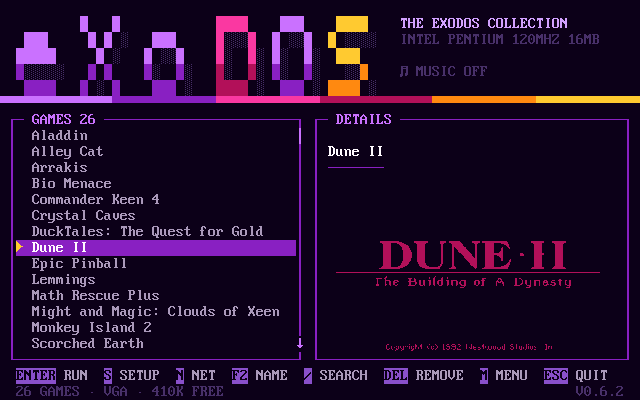
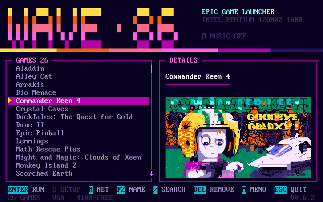
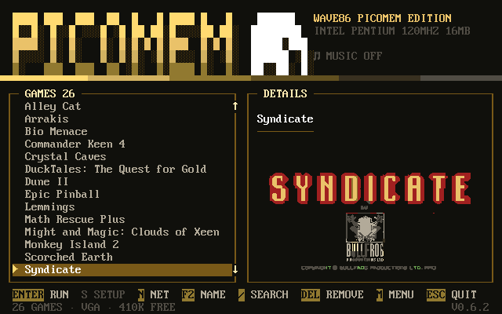
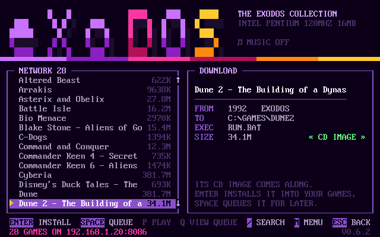
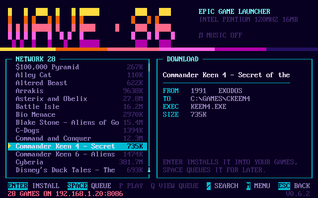
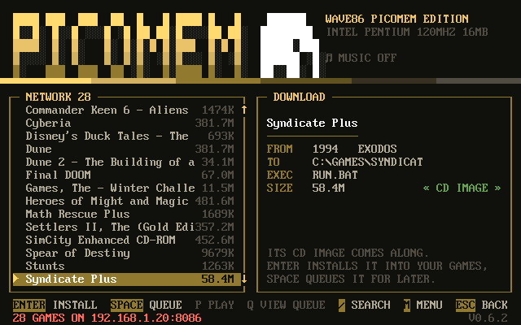

# WAVE86

A game launcher for DOS. It lists the games on your disk, runs each one
with all of conventional memory free, and plays music while you choose.
From a server on your network it installs games from the eXoDOS
collection, or plays them straight off the server. It runs on real DOS
machines, from an XT up, and in DOSBox.

| eXoDOS (the default) | WAVE86 | PicoMEM |
| --- | --- | --- |
|  |  |  |
|  |  |  |

`theme=` in WAVE86.INI picks the look.

## Download

Every [release](https://github.com/retro-city/wave86/releases) has three
zips:

| File | What it is |
| --- | --- |
| `wave86-<version>-dos.zip` | the launcher, for the DOS machine |
| `wave86-<version>-server.zip` | the server, for a Mac, Linux or Windows machine on the same network; its README says how to start it |
| `wave86-<version>-picomem-hdd.zip` | a ready-made disk for a PC with a PicoMEM 2 card, booting into WAVE86 |

## Putting it on the DOS machine

Copy the `wave86` folder from `wave86-<version>-dos.zip` to `C:\WAVE86`,
put each game in its own folder under `C:\GAMES` (or change `gamedir=`
in `WAVE86.INI`), add `C:\WAVE86` to the PATH and type `WAVE`. To boot straight into the menu,
put `CALL C:\WAVE86\WAVE.BAT` at the end of `AUTOEXEC.BAT`.

Start it with `WAVE`, not `WAVE86.EXE`. Both work, but only the batch
file hands the game every byte of memory; the bare EXE stays resident
and runs the game from there.

For games from the network, start the server (its README says how),
then press N in the launcher and type the server's address.

`WAVE86 /diag` prints what the launcher found - DOS version, free and
upper memory, video card, sound, CPU - when something looks wrong.
`WAVE86 /launch KEEN4` starts a game directly, for a boot-into-game
AUTOEXEC.

## What it does

- Lists the games in `C:\GAMES`, one folder per game, and finds the
  program that starts each one and its setup program.
- Runs a game with all of conventional memory free: the launcher writes
  a small batch file and quits, and `WAVE.BAT` brings the menu back when
  the game ends.
- Plays music while you choose: AdLib tunes, and ProTracker MODs through
  a Sound Blaster, turned on from the menu (`M`, then `M`).
- Shows a picture of each game, made from the collection's artwork.
- Installs games from the server, a whole queue at a time, and carries a
  stopped download on from where it stopped. A game is in the list from
  the moment its install starts.
- Plays a game off the server without installing it, CD games included.
- Sets a game's CPU speed, memory limit and sound mode (`O`).
- Works on VGA, EGA, CGA and mono screens.

## Keys

In the games list:

| Key | Does |
| --- | --- |
| Up/Down, Home/End | move (a letter jumps to the next game starting with it) |
| Left/Right, PgUp/PgDn | turn the page |
| Enter | run the game; for a game still being installed, fetch the rest |
| S | run its setup program |
| / | search; F3 searches on |
| O | the game's options: CPU slowdown, memory limit, sound mode |
| P | the details instead of the picture, and back |
| F2 | rename the game |
| Del | remove the game and its folder, after a yes |
| A | the PicoMEM's sound card: Sound Blaster or Gravis UltraSound |
| R | rescan the games folder |
| N | the games on the server |
| M or ? | a menu of everything, each with its key |
| + / -, < / > | volume, previous / next track |
| Esc | back to DOS |

In the server's games (N):

| Key | Does |
| --- | --- |
| Enter | install the game, or the whole queue; in the PicoMEM image's Network Mode, play it off the server |
| Space | put the game in the install queue, or take it out |
| I | install the game, or the queue, in every mode |
| P | play it off the server |
| Q | the queue; Del takes one out, Enter fetches them |
| / or S | search; F3 searches on |
| M | the menu: L fetches the list again, C switches between the disc with the game and the disc on the server, U updates WAVE86 itself |
| Esc | back to the games |

With no `server=` in the INI, N asks for the address first, adds port
8086 when none is typed, and writes it into the INI.

### A ready-made disk for a PicoMem 2

`make picomem-image` builds `build/pmwave-edrdos.img`, a 512 MB hard-disk
image (volume label `WAVE_EDR`) that boots EDR-DOS straight into the
launcher on a machine with a PicoMem 2; a release carries it ready-made
as `wave86-<version>-picomem-hdd.zip`. Below are the same image on
FreeDOS (label `WAVE_FD`) and on a DOS of your own (`WAVE_MS` for
MS-DOS), each named after what it runs. Copy it into the `HDD` folder of
the card's SD card (13 characters at most before `.img`), pick it as
HDD0 in the card's BIOS Setup (S at its "Press S for Setup" prompt;
Disk menu, with PicoMEM Boot Code on; Other menu, NE2000 on at port
300, IRQ 3), and on the SD's root make `EXODOS` and `CDROM` folders for
the games and the discs and a `wifi.txt` with the network's name on
line 1 and its password on line 2. On the image:

    C:\WAVE86      the launcher as make dist packs it, with an INI for
                   this machine and the MTCP.CFG that DHCP writes to
    C:\PICOMEM     the card's DOS tools (PMINIT, PMDFS, PM2000, NE2000,
                   PMMOUSE...) and CDMKE.SYS
    C:\MTCP        Michael Brutman's mTCP client programs (FTP, Telnet,
                   Ping, HTGet...)
    C:\ULTRASND    the Gravis UltraSound software (ULTRASND.INI,
                   ULTRINIT, ULTRAMID, the patches)
    C:\DOS         FreeDOS utilities: EDIT, MEM, MORE, XCOPY, DELTREE,
                   ATTRIB, FIND, TREE, LABEL, and HIMEMX and JEMM386, the
                   memory managers

CONFIG.SYS and AUTOEXEC.BAT follow the ones in the card's D6 package,
without comments, and open with a boot menu, ten seconds and then 1:

    1  PicoMEM - Standard Mode (CD, DFS and Network)
    2  PicoMEM - Local Mode (CD and DFS)
    3  PicoMEM - Network Mode
    4  PicoMEM - Memory Optimized
    5  Safe Mode

1 loads HIMEMX and `JEMM386 RAM X=D000-D7FF` (XMS, EMS and upper memory,
with the card's own BIOS and RAM window kept out of it), `DOS=HIGH,UMB`,
NetDrive's driver and `CDMKE.SYS /D:MSCD000 /P:250 /Q`, the driver for
the card's emulated CD-ROM, both high. AUTOEXEC.BAT then frees D: for
the disc (`DRVOFF D:`), runs `PMINIT /K /SB 1 /GUS 1 /MPU 1`, mounts the
SD card as W: with `PMDFS S-W`, gives the CD-ROM D: through SHSUCDX,
loads CuteMouse and the card author's packet driver (`PM2000 0x60`),
runs `DHCP -retries 2 -timeout 10` (twenty seconds at most with the
Wi-Fi down; Esc skips it) and ends in `CALL WAVE.BAT`. 2 is 1 without
NetDrive, the packet driver and DHCP. 3 is for playing games straight
off the server: NetDrive and the network, no W: and no CD-ROM driver,
and `WMODE=Network` in the environment, which makes the launcher open
on the network view with Enter playing the game off the server (I
installs it), discs left on the server and every disc mounted in
software over NetDrive whatever `imgmount=` says. 4 gives JEMM386
`I=B000-B7FF` as well - the mono text area, unused with a VGA in colour,
as 32 KB more upper memory - and loads nothing but the sound cards and
W: before the launcher. 5 loads no memory manager and no driver and
stops at a prompt in C:\WAVE86. Each item sets `WMODE` (Standard,
Local, Network, Memory, Safe). BLASTER, ULTRASND and ULTRADIR are set as
the D6 package sets them, and every number - IRQs, port, packet
interrupt - is written into the command that uses it. The shell is
COMMAND.COM with 2048 bytes of environment. EDR-DOS's kernel has no
MENU, so its CONFIG.SYS asks with ECHO, TIMEOUT and SWITCH and sets
CONFIG itself (STD, LOCAL, NET, MEM, SAFE, as DOS 6's [menu] does;
FreeDOS's MENU sets the number); its wait shows no countdown - the
kernel polls the keyboard and prints nothing - so the prompt says "1 in
10 seconds" instead. AUTOEXEC.BAT goes to the item's label either way.

WAVE86.INI has `gamedir=W:\EXODOS`, `cdrom_storage=W:\CDROM`,
`imgmount=PICOMEM`, `cdrom_letter=D` and `theme=picomem`; `server=` is
yours to fill in. There is no disk cache: one would speed up only C:,
the image the card serves through its BIOS, never W:, which PMDFS hands
straight to the card as a network drive. `WAVE86 /diag` prints the
largest free upper block and whether DOS has the blocks linked; the
other lever for upper memory is BIOS Setup's shadowing of C800-DFFF,
which, turned off, gives those ranges back.

Discs: `imgmount=PICOMEM` with no `cdmount_picomem=` command, since
the PicoMem 2 has no DOS command to hand it an image yet: the discs go
to `W:\CDROM` as cue/bin, and when a game needs its disc the batch
names it - `PLEASE LOAD SETTLR2G.CUE ON YOUR PICOMEM NOW` - and waits
for a key while you pick it on the card, then goes on with the disc on
D: (CDMKE.SYS and the boot-time `SHCDX86 /D:?MSCD000,D` line give the
card's drive that letter once the firmware has one). When the card gets
a load command, `cdmount_picomem=` in the INI is the switch and the
prompt goes away.

The pieces are in the repository, under `third-party/` (its README
says what is where; `THIRD-PARTY.md` whose it is), because retro
download sites come and go: the PicoMEM D6 release package and the
card repository's `drivers/` folder, whole (C:\PICOMEM is the package's
PICOMEM folder plus NE2000.COM from `drivers/`, and a program put
straight into `third-party/picomem`, as the author's PMDFS.EXE fix is,
replaces the package's copy; `PICOMEM_DIR=` uses a folder of your own),
mTCP's client zip (`MTCP_TOOLS=` for your own), CDMKE.SYS, the PicoGUS
project's copy (`CDMKE_DIR=` empty leaves it out, and the boot menu's
items 1 and 2 load no CD-ROM driver), the Gravis UltraSound
software, the `ultrasnd.zip` in that `drivers/` folder (`GUS_DIR=` empty
leaves it out, then C:\ULTRASND is empty, though AUTOEXEC.BAT still sets
ULTRASND; `GUS_DIR=` also takes an unzipped copy of your own), the
FreeDOS utilities as the 1.3 packages from ibiblio (`DOS_PKGS=` is the
list, `DOS_DIR=` a folder of your own, `DOS_DIR=` empty leaves C:\DOS
out), and the EDR-DOS release zip (below). The Makefile unpacks each
into `build/` on first use. `make update-third-party` (or `update-mtcp`,
`update-picomem`, `update-gus`... one at a time) fetches them afresh
from where they came, says what changed, and leaves them for you to
commit; `make check-third-party`, which CI runs, says whether
every file is the one recorded in `third-party/SOURCES.txt`. `IMAGE=`
and `IMAGE_MB=` change the file and its size; the work files stay in
`build/<name>-work/` wherever the image goes, so
`IMAGE=/Volumes/SD/HDD/PMWAVE.IMG` writes nothing else to the card. A
folder given by hand that does not exist fails before anything is built.

#### Other kernels, and a DOS of your own

The tooling on the image - WAVE86, the card's programs, mTCP - does not
care which DOS is under it, so the builder takes three:

- `make picomem-image` - the EDR-DOS kernel (Enhanced DR-DOS, the one
  SvarDOS boots), as above, a drop-in for KERNEL.SYS under the FreeDOS
  boot sector, from its release zip in `third-party/edrdos` (`EDR_VER=`,
  `EDR_DIR=` for a folder of your own): `pmwave-edrdos.img`. Its licence
  is a grey area - a 2022 grant from DRDOS, Inc. in the repository,
  Caldera's 1997 non-commercial terms still in the tree - fine for this
  repo, not for anything commercial. `ver` says Enhanced DR-DOS based on
  Caldera OpenDOS 7.01; to programs it is DOS 7.10.
- `make picomem-image KERNEL=freedos` - the FreeDOS kernel, off
  `dos/FREEDOS.IMG`: `pmwave-fdos.img`. The same files and menu; its
  CONFIG.SYS has FreeDOS's MENU lines.
- `make picomem-image DOS_DISKS="~/dos/Disk1.img ~/dos/Disk2.img"` - your
  own licensed DOS, from its setup floppies (the bootable one first, with
  SYS.COM and EXPAND.EXE on it). Nothing of it enters the repo: the builder
  copies the boot floppy, adds the packed tools from the other disks, gives
  the copy an AUTOEXEC.BAT that runs `SYS C:` and EXPANDs the tools into
  `C:\DOS`, and boots that copy in dosbox-x with the empty partition as C:.
  So that DOS writes its own boot sector and system files, the only way
  that works for MS-DOS (its boot sector wants IO.SYS in the first
  directory entry); then the rest of the tree goes on with mtools, which
  leaves what is there alone. CONFIG.SYS gets DOS 6's own `[menu]` with
  the same five items, and `HIMEM.SYS /TESTMEM:OFF` and `EMM386.EXE RAM
  X=D000-D7FF` in place of HIMEMX and JEMM386; AUTOEXEC.BAT loads
  SHSUCDX low (its LOADHIGH into an EMM386 block ended in a fault loop
  in the boot test); DBLSPACE.BIN or DRVSPACE.BIN comes off the root, so
  IO.SYS loads no DoubleSpace driver; and WAVE86.INI gets `slowcache=0`,
  since MS-DOS 6.22's memory managers crash when SLOWDOWN touches the
  CPU cache. Named after the disks: `pmwave-msdos.img` for IO.SYS,
  `pmwave-pcdos.img` for IBMBIO.COM.
  Built and boot-tested here with MS-DOS 6.22's three setup disks (29
  tools into C:\DOS, `MS-DOS 6.22` under it); PC DOS follows the same
  route but has not been tried. The disks are only ever read.

The image is shaped the way the card reads disks: its BIOS is DOSBox's
INT 13h, CHS only, assuming 16 heads and 63 sectors and shifting to 32
heads above 1024 cylinders, so 512 MB is 520 x 32 x 63 and dosbox-x's
IMGMAKE is asked for exactly that; the MBR and BPB are checked against
what the card will report before the tree goes on. IMGMAKE leaves no
boot code, so the FreeDOS FAT16 boot sector (`dos/FAT16.BS`, from the
kernel's own `boot/boot.asm`) goes over the partition's, keeping
IMGMAKE's BPB, as SYS.COM does; the kernel and shell are EDR-DOS's,
from its release zip (with `KERNEL=freedos`, the ones on
`dos/FREEDOS.IMG`), and `tools/fat16.py` writes the tree. The INI is the
shipped WAVE86.INI with those keys set in place (a live key replaced, a
commented-out example brought to life; the comments stay, and the build
prints each line it changed). Then the self-test: a copy of the image
boots in dosbox-x, headless, from the hard disk (no floppy), with the
launcher's WAVE.BAT swapped for a stub that records `ver`, `set` and
`WAVE86 /diag`. The build passes only if the image's own CONFIG.SYS and
AUTOEXEC.BAT get that far along the boot menu's item 1 (ten seconds, no
key), with XMS from the memory manager, the 2048-byte environment, PATH,
MTCPCFG, BLASTER, ULTRASND, ULTRADIR and WMODE=Standard in the
environment - once as dosbox-x boots it (LBA) and once with the boot
sector forced to CHS, the card's path. That second run patches one byte
of the FreeDOS boot sector (EDR-DOS boots under the same one); an image
SYS'd from `DOS_DISKS=` has that DOS's own sector, which the patch does
not know, so it boots once, the LBA way, and the build says so. The
PicoMem programs and DHCP find no
card in dosbox-x and give up, which is the point: the batch gets past
them. About a minute; the results stay in `build/<name>-work/`
(`build/pmwave-edrdos-work/` for the default).

What dosbox-x cannot tell you, to check on the card itself:

- Whether the card's tools see the card at all: JEMM386's `X=D000-D7FF`
  is meant to keep its UMBs off the card's window, and is the first
  thing to look at if PMINIT, PMDFS and PM2000 all fail at once (the
  window moves with a `BIOS` line in the SD's config.txt).
- The geometry. The 32-head shift is in the firmware source on `main`;
  if the card reports the disk wrong, `IMAGE_MB=500` gives 1015 x 16 x 63,
  which needs no shift.
- CD-ROM emulation is not in the PicoMem 2 firmware yet; whether the port
  stays 250 and the device MSCD000 when it ships is the wiki's word.
- PMDFS on EDR-DOS and FreeDOS: it is EtherDFS for DOS 4+. If games on
  W: go missing or look empty, `WAVE86 /diag` prints the first game
  folder as the scan lists it (names, sizes, attributes).
- The IRQs: the card's own on 7 (a jumper, mandatory in this firmware),
  Sound Blaster and GUS on 5 with DMA 1 (the other jumper), NE2000 on 3 -
  the card author's numbers. The packet driver is the author's PM2000,
  which reads the port and IRQ off the card and reads odd-sized packets
  right; the stock NE2000.COM, also in C:\PICOMEM, does not, per the
  author's notes, and a transfer that stalls at the same place every
  time is what that looks like: the frame fails its checksum on every
  retransmission.
  Whether JEMM386 gets in the way of the card's Sound Blaster is not
  documented (the PicoMem 1 warning is about EMM386 and software DMA);
  `NOEMS` after `X=D000-D7FF` is the next thing to try, then no JEMM386.
- Big writes through PMDFS, a redirector drive: `netwrite=512` in the
  INI if WAVEGET stumbles writing to W:.

## WAVE86.INI

Lives next to the EXE. The one that ships is the reference: every
setting the launcher and WAVEGET read, one per line at its default, in
alphabetical order, with what it does in a comment above it, and at the
end a commented-out game section with every per-game property. A value
runs to the end of its line, so comments go on lines of their own:

    ; Where the games are, one folder each: a full path, or one relative to
    ; the launcher's folder.
    gamedir=C:\GAMES

    [KEEN4]
    name=Commander Keen 4

Section names are game folder names, and the sections live in
`GAMES.INI` in the games folder itself (`W:\EXODOS\GAMES.INI` on a
PicoMem's SD card), so the settings travel with the games; a section
still in `WAVE86.INI` moves there the next time the launcher starts,
and the launcher says so once. The launcher adds a section for every new
folder it finds, so the file always lists your collection; press `F2`
in the menu to give a game a proper name (or run
`WAVE86 /name KEEN4 Commander Keen 4` from the prompt). Per game you can
set `name`, `exe`, `setup`, `args`, `cd` and `hide=1`, and the keys in
the next two sections; `source=exodos` or `source=tdc` (written, with
`netinstall=` and the other `net...` keys, when an install from the
server starts: see *A queue, and picking up where it stopped*) shows
where the game came from in the details. Anything you leave out is
detected: the launcher prefers a program named like the folder (an EXE
over a BAT or COM), then `START`, `PLAY`, `GO`, `RUN` or `GAME`, and
ignores the usual `SETUP`, `INSTALL`, `DOS4GW` and friends.

### Too fast, or too much memory

A 1.2 GHz machine is too fast for a game that paces itself by the CPU,
and 128 MB is too much for one that counts memory in a 16-bit register.
`O` on a game (also in the menu) opens its options: CPU SLOWDOWN - off,
Pentium 133, 486 DX2-66, 386 DX-33, 286 AT, XT - and MEMORY LIMIT - off,
4, 8, 12, 16, 24, 31 or 63 MB - plus the sound mode (see below). Left
and right step a value; Enter writes `slowdown=`, `memlimit=` and
`sound=` into the game's section, Off (DEFAULT for the sound mode)
removes them, and Esc changes nothing. A value written into the INI by hand that no preset matches -
`slowdown=486:40`, `25%`, a `memlimit=` of 20 - shows as CUSTOM and is
left as it is, and Enter writes only the settings you changed. The
batch that runs the game then does, before it:

    C:\WAVE86\MEMLIM.EXE 24
    C:\WAVE86\SLOWDOWN.COM /Q /DisableHotKeys /Beep:No /MHz486:25
    if not errorlevel 1 echo 1 > C:\WAVE86\SLOWDOWN.ON

and after it `MEMLIM /FREE` and, when that mark is there, `SLOWDOWN /Q
/Uninstall` and the mark's removal - and those again at the top of
every batch, so a game that crashed leaves nothing behind for the next
one. The mark keeps SLOWDOWN quiet: asked to uninstall while not in
memory it says so, beep and all, whatever `/Q` says. Without
`MEMLIM.EXE` or `SLOWDOWN.COM` next to the launcher, its lines are
left out.

`MEMLIM` is ours (`src/memlim.c`, 8086 code): it takes extended memory
through XMS until the largest free block, and the total, are what the
game may see, keeps the handles in `MEMLIM.DAT` next to itself, and
`/FREE` gives them back. The interesting numbers: Aladdin compares
each XMS request against the largest free block with a signed 16-bit
jump, so anything from 32768 KB up fails it - 31 MB works, 36 does not;
eXoDOS runs it with `memsize=16`. `SLOWDOWN` is Bret Johnson's (freeware,
the COM and its DOC together, unmodified, in `third-party/slowdown` from
the FreeDOS package; `make update-slowdown` refreshes them, `make dist`
and `U` carry them to the DOS machine; its terms are in its DOC and in
THIRD-PARTY.md). Its eras are its own model of a 486's speed, not a
measurement of yours: `slow_486=` and friends in the global section
replace what an era means when the presets feel wrong, `slowcache=0`
keeps it off the CPU cache (MS-DOS 6.22's HIMEM/EMM386 crash when
anything touches it), and `slowint70=1` paces it off the real-time
clock instead of the timer tick, smoother but not for games that use
that interrupt themselves. A game that reprograms the timer can defeat
it; PC-speaker sound goes odd under any software slowdown.

Not every crash on a fast machine is a slowdown case. Lotus: The
Ultimate Challenge dies with a divide overflow in a speed-calibration
loop the game itself never uses; the fix is a two-byte patch to
`LOTUS.DAT` (`FB F7 F1` -> `FB 90 90`, once), after which it runs at
full speed - no slowdown reliably avoids the crash.

### Per-game setup: PicoGUS modes, environment, extra commands

A game's section can also carry things that go into the batch file
around the game:

    [DOOM]
    sound=gus
    env=ULTRASND=240,1,1,5,5
    pre=C:\UTILS\CTMOUSE.EXE
    post=C:\UTILS\CTMOUSE.EXE /U

`env=` becomes a `SET` (repeat the line for more), `pre=` runs before
the game and `post=` after it. `sound=` names a mode; the command for
each mode is defined once at the top of `WAVE86.INI`, and `sound=` up
there is the default for games that don't say:

    soundcmd_sb=C:\PICOGUS\PGUSINIT.EXE /mode sb
    soundcmd_gus=C:\PICOGUS\PGUSINIT.EXE /mode gus
    sound=sb

With that, a PicoGUS switches to GUS for Doom and back to Sound Blaster
for everything else, on every launch, whether you start from the menu
or with `WAVE86 /launch DOOM`. The details pane shows the mode, and
`O` on a game picks one.

## Music

The `.IMF`, `.WLF` and `.MOD` files in `MUSIC\` next to the EXE are the
playlist, in name order, 16 at most.

**IMF** is the AdLib format id Software used in Commander Keen and
Wolfenstein 3D: a stream of OPL2 register writes with delays. `.IMF`
plays at 560 Hz, `.WLF` at Wolf3D's 700 Hz, and both the raw and the
length-header variants are fine. Tunes up to 240 KB are loaded into far
memory and freed before any game runs. It plays on an AdLib or on the FM
side of any Sound Blaster.

**MOD** is 4-channel ProTracker (`M.K.`, `M!K!`, `4CHN`, `FLT4`), mixed
in software and pushed through the Sound Blaster's DMA. The mixer picks
its rate from the CPU: 22 kHz on a 386 or better, 11 kHz on a 286, and
on an 8086 MODs are skipped. The usual effects are there (arpeggio,
portamento, vibrato, offset, volume slides, jumps and breaks, pattern
loop, fine slides, retrigger, cut, delay, speed and tempo). FastTracker
XM is not supported; OpenMPT can export a 4-channel XM to MOD.

The four synthwave tracks and `WAVE86.MOD` are generated by
`tools/makemusic.py` and `tools/makemod.py` (`make music` rebuilds them).
They are the only tunes in the repo. Anything else you drop into
`music/` is copied into `build/MUSIC` but left out of the `make dist`
zip, which takes only the tunes in git. Scene tunes belong to their
authors: list yours in `.gitignore`, as the ones here are.

To use AdLib music from the demoscene, build `tools/scene2imf` (needs
`brew install adplug`). It plays a RAD, D00, HSC, A2M, SA2 or CFF file
through libadplug and records the register writes as an IMF:

    c++ -O2 -std=c++17 -I/opt/homebrew/include -I/opt/homebrew/include/libbinio \
        -L/opt/homebrew/lib -ladplug -lbinio -o tools/scene2imf tools/scene2imf.cpp
    tools/scene2imf ~/Downloads/tune.rad music/TUNE.IMF

Keep to 8.3 filenames. `tools/imf2wav` (built the same way from
`tools/imf2wav.cpp`) renders an IMF to WAV so you can listen on the Mac.

### Sound cards

Detection is the classic AdLib timer test, but it waits up to 30 ms for
the flag because emulated cards such as the PicoGUS raise it late. If a
Sound Blaster DSP answers, FM is assumed present anyway, since every SB
has one. `adlib=` and `modrate=` in the INI override all of this.

## Building

You need Open Watcom V2 in `toolchain/` (it is not in git: 50 MB of
compilers). `make toolchain` fetches `ow-snapshot.tar.xz` from a dated
release of github.com/open-watcom/open-watcom-v2 (`OW_TAG=` in the
Makefile, which CI uses too) and extracts the host tools for your
machine (`armo64` on an Apple silicon Mac, `bino64` on an Intel one,
`binl64` on Linux) plus `h` and `lib286`. By hand, the same three
folders into `toolchain/` will do.

    make          builds build/WAVE86.EXE and the other DOS programs, with
                  WAVE.BAT, the INI, MUSIC\ and THUMBS\ beside them
    make run      opens it in dosbox-x, with sound and networking (see below), at
                  50000 cycles, a fast 486; CYCLES=3000 for an XT
    make waveserve  starts the game server on this machine, with its console
    make picomem-image  build/pmwave-edrdos.img, a bootable 512 MB EDR-DOS disk
                        for a PicoMem 2 (see above); KERNEL=freedos makes
                        build/pmwave-fdos.img with the FreeDOS kernel
    make test     renders the UI headlessly to build/screen.png
    make dist     the DOS side as dist/wave86-<version>-dos.zip, ready to copy over
    make music    regenerates the soundtrack
    make clean

The GitHub workflow in `.github/workflows/build.yml` builds the same on
Linux and keeps the zips as artifacts of every build; for a tag like
`v0.6.2` it makes a release that carries three:

    wave86-<ver>-dos.zip           the DOS side (make dist)
    wave86-<ver>-server.zip        the server, ready to run: waveserve and
                                   the files it uses, the DOS programs it
                                   hands to WAVEGET UPDATE, NetDrive's
                                   server for macOS, Linux and Windows, the
                                   eXoDOS torrent, a settings file and a
                                   README (make server-release)
    wave86-<ver>-picomem-hdd.zip   the EDR-DOS disk for a PicoMEM 2 and its
                                   README (make picomem-release)

`<ver>` is the tag without its `v` (`RELEASE_VER=`; the launcher's
own version when built by hand), and a tag with a hyphen in it, like
`v0.6-pre1`, is published as a pre-release. The image is built and
boot-tested on an Ubuntu 26.04 runner with its own dosbox-x and mtools,
after the first job has made the release, on every push as well as for
a tag; the push builds leave it as an artifact.

Everything is compiled for the 8086 instruction set. The launcher is
medium model (far code, near data) and comes out around 90 KB; MEMLIM
and DRVOFF are small model, and WAVEGET and DHCP, built on mTCP, large.

## Screenshots in the details pane

A game with a picture shows it in the details pane under its name and
nothing else (a pending install adds a line saying so); `P` or `D`
swaps in the details (path, program, setup, tags) and back. The picture
is `THUMBS\<DIR>.THM` next to the EXE, or one that came with the game
from the server (below). It is still text mode: a VGA's character
shapes live in RAM, and in 512-character mode bit 3 of the attribute
picks one of two fonts. The second font starts as a copy of the first,
so the bright UI text is unchanged, and both banks lend the CP437 codes
the UI never uses, 274 glyphs in all. Each cell is two palette colours
plus a 1-bit pattern loaded as a custom glyph; flat cells and cells
that look like a standard block character use that character, and in a
busy picture near-identical patterns are merged until they fit (36 by
10 is 360 cells). The server makes pictures 36 by 10; the launcher
shows any size up to 38 by 10, centred. VGA only.

    python3 tools/makethumb.py screenshot.png THUMBS/KEEN4.THM --size 36x10    # needs ffmpeg

The cells are matched to a theme's colours, so a picture belongs to a
theme: `THUMBS\KEEN4.THM` is for the default look, `THUMBS\wave86\` holds
the ones made with `--theme wave86`, and the launcher looks in the
folder named after its theme first. The picomem look ships no set of
its own: a game installed from the server brings a picture made for
whichever theme the INI names.

### A picture with every game from the server

eXoDOS has artwork for nearly every game, named after its title: title
screens, gameplay shots, box art, logos. A game installed from the
server comes with one of them made into this picture, as
`THUMBS\<THEME>.THM` in the game's folder, which is the third place the
launcher looks. `netart=` in WAVE86.INI says which kind - `title` (the
title screen, the default), `gameplay`, `box`, `logo`, `disc`, `select`,
`over`, `back` or `3d` - and another kind stands in for a game that has
none of that one; `netart=0` fetches no picture. WAVEGET asks for it as
`?art=<kind>&theme=<name>&thumb=36x10`, so the picture is made for the
colours of the theme the INI names, at the size the launcher shows.

The server makes each picture once, from `Images/MS-DOS/` in the eXoDOS
folder (or from the metadata zip in the torrent, one piece per picture,
when there is no such folder), into `--thumbs DIR` (`thumbs=` in
waveserve.ini, `~/.wave86/thumbs` by default; `--thumbs none` or an
empty setting turns pictures off). It needs ffmpeg on the PATH; without
it the server says so once and sends none. A picture is 2 to 5 KB. The
launcher fetches it first, on its own: the moment an install starts
(for a queue, every game's at once), `WAVEGET THUMB` gets it from the
server's `/thumb/`, before any of the game's files. It also comes as
the last file of the pack.

The server's own folders are all under `~/.wave86`: `cd` for the
NetDrive volumes, `thumbs` for the pictures and `torrent` for the pieces
fetched from the swarm. Before 0.6 they were `~/wave86-cd`,
`~/wave86-thumbs` and `~/wave86-torrent`; the server moves one it finds
there to its new place when it starts, unless the port is taken (another
server may still be using it) or the setting points somewhere else.

## Games from eXoDOS or the Total DOS Collection over the network

Press `N` in the menu and the launcher shows the games in your
collection, served from a machine on the LAN. Enter (or `I`) installs
one straight into `C:\GAMES`: it is in the games list, named, from the
moment the install starts, marked PENDING until all of it is there and
then with its executable set. `P` plays a game off the server without
copying. Nothing is unzipped on the DOS side: the server streams plain
files. Del in the games list takes an installed game off the disk again.

On the machine with the collection, unzip `wave86-<version>-server.zip`
and start `run-server.sh` (`run-server.bat` on Windows; its README.txt
says what it needs), or, from this repository on a Mac, Linux or a NAS
with Python:

    make waveserve
    make waveserve EXODOS=/Volumes/Games/eXoDOS PORT=8086
    make waveserve TDC=~/Downloads/TDC WAVESERVE_ARGS="--log serve.log"
    make waveserve TORRENT=eXoDOS.torrent

`make waveserve` builds first, since the server hands `build/` to WAVEGET
UPDATE, unpacks the NetDrive server for this machine from
`third-party/netdrive` if `build/netdrive` is not there yet, and starts
`tools/waveserve.py` with its console; `q` there stops it.

The settings are in `waveserve.ini`, next to the Makefile: one per line,
alphabetical, each with what it does in a comment above it, as in
`WAVE86.INI`. They are what the server starts with; where the bare
command line falls back to something else, the comment says so. They
cover the collection (`exodos=`, `tdc=`, `torrent=`), the port, whether
CD games are listed, where the NetDrive volumes, the torrent pieces and
the pictures are kept, the torrent's port, interface and upload limit
(`torrent_upload=1024`, KB/s), and so on. A relative path is taken from
the file's folder. A variable to `make waveserve` overrides a line for
one run:

| variable | overrides |
| --- | --- |
| `EXODOS`, `TDC`, `TORRENT` | `exodos=`, `tdc=`, `torrent=` |
| `PORT`, `MAX_MB` | `port=`, `max_mb=` |
| `CACHE`, `NETDRIVE_DIR`, `THUMBS_DIR` | `cache=`, `netdrive=`, `thumbs=` |
| `WAVESERVE_ARGS` | anything else, such as `"--log serve.log"`, `--headless`, `--no-cd`, `--netdrive none` |

Run by hand, `tools/waveserve.py` reads the same file (`--config FILE`
for another, `--config none` for none), and every flag it takes is a
line in it; so the same thing is:

    python3 tools/waveserve.py ~/Downloads/eXoDOS --port 8086 --cd
    python3 tools/waveserve.py --tdc ~/Downloads/1981-1992 --port 8086
    python3 tools/waveserve.py ~/Downloads/eXoDOS --tdc ~/Downloads/TDC --port 8086

For eXoDOS it indexes the game zips, reads each game's `dosbox.conf`
for the program that starts it and takes genre and description from the
platform XML. `cd=1` (`--cd`) includes the CD games: the server turns
the cue/bin in the zip into a plain ISO while it streams (the 2048 data
bytes of each sector, cut at the volume size; audio tracks are dropped),
so Syndicate Plus arrives as its files plus `CD\SYNDICAT.ISO`, and the
network view marks such games "CD IMAGE".

The Total DOS Collection is plain folders, `1992/Title (1992)(Publisher)
[Genre]/`, one game each, so there is no manifest to read: the title,
year, publisher and genre come from the folder name, and the launcher
works out the executable once the files are on disk. The details pane
says which collection a game is from, and the games list tags downloaded
games with eXoDOS or TDC. Both serve from one port; the server addresses
TDC games as `tdc:DIR`.

A Total DOS Collection still coming in through a torrent client is
handled: folders with nothing downloaded yet are left out, and a game
whose files are partly placeholders (0 bytes, dated the day the torrent
started) is listed as "INCOMPLETE" and shipped without them. If a game
arrives whole (WAVEGET checks every file's sum before it says so) and
the scan still finds nothing to run in its folder, the launcher says so
on the status line instead of listing it or fetching it again;
`WAVE86 /diag` shows the folder as the scan lists it, names, sizes and
attributes, which is where a drive that lists things its own way (the
card's SD through PMDFS) shows. The server re-indexes every five minutes.

On the DOS machine, have `WAVEGET.EXE`, `DHCP.EXE` and `MTCP.CFG` next
to the launcher (the DOS zip puts them there; a build has them in
`build/`), put the server's address in the INI - or leave it empty and
press N in the launcher, which asks for it and writes it there:

    server=192.168.1.10:8086

give COMMAND.COM a bigger environment in `CONFIG.SYS`, since DOS's
256-byte default runs out once `MTCPCFG` joins PATH and the sound
variables ("Out of environment space"):

    SHELL=C:\COMMAND.COM C:\ /E:1024 /P

and get the network card up in `AUTOEXEC.BAT` (any NE2000; a PicoMem
takes the card's own `PM2000 0x60` in place of the NE2000 line):

    LH NE2000 0x60 5 0x300
    SET MTCPCFG=C:\WAVE86\MTCP.CFG
    C:\WAVE86\DHCP

DHCP asks to be called `WAVE86`, which is the name the machine gets in
your router's list; `HOSTNAME` in `MTCP.CFG` is where to change it.

`LH` wants a memory manager providing upper memory (HIMEM plus EMM386,
or `dos\JEMMEX.EXE` with `DOS=HIGH,UMB`); without one it just loads
low. The CD drivers the launcher's batches load use `LH` too.

`make run` does all of this inside dosbox-x: it turns on the NE2000
emulation (slirp backend), loads the packet driver from `Z:\SYSTEM`,
runs DHCP and points the launcher at `10.0.2.2:8086`, which is this
machine as the emulator sees it, through the `WAVESRV` environment
variable (it overrides `server=`). Start `waveserve.py` first.

`NE2000.COM` in `net/` is the Crynwr packet driver (GPL) for the card,
the same one dosbox-x carries on its Z:. `NETDRIVE.SYS` and
`NETDRIVE.EXE` are mTCP NetDrive's DOS side (GPL, source in
`net/mtcp/APPS/NETDRV`). `WAVEGET.EXE` is a separate program built on
mTCP (GPL v3, sources in `net/`), so the launcher itself stays a small
8086 program with no network code; downloads run through the same batch
hand-off as games, with all memory free. Esc aborts a download.

The list is read from disk as you scroll, with only a table of line
offsets in memory, so a collection of 16,000 games fits in 64 KB. A
letter key jumps through the titles starting with it, and S (or /)
searches for a title by any part of it - the list file is read straight
through for that, one seek and then sequential, so 7,600 titles are
searched before the key is back up. The server addresses games by
folder name, so a list that is a few minutes old still fetches the right
one.

## CD images

A game with an ISO in its `CD\` folder (or `cd=` in its section of
`GAMES.INI`) gets the image mounted as D: for as long as it runs. The
lines go into the same batch file as the game, so it works from the
menu and from `WAVE86 /launch`:

    LH C:\WAVE86\SHCDHD86.EXE /F:C:\GAMES\SYNDICAT\CD\SYNDICAT.ISO /Q
    LH C:\WAVE86\SHCDX86.COM /D:SHSU-CDH,D /I /Q
    call RUN.BAT
    C:\WAVE86\SHCDX86.COM /U /Q
    C:\WAVE86\SHCDHD86.EXE /U /Q

On real DOS that is Jason Hood's SHSUCDHD (an image file as a CD-ROM
device) and SHSUCDX (his small MSCDEX replacement), in their 8086
builds, assembled from his sources into `cdrom/` and copied next to the
launcher by `make`; `/I` lets SHSUCDX install beside an MSCDEX. They
load before the game and unload after it, so nothing stays resident.
Under DOSBox the launcher uses `IMGMOUNT D image -t iso` instead; it
knows it is in DOSBox by the IMGMOUNT on its Z: drive. `cdmount=` and
`cdunmount=` in the INI replace either, with `$ISO` standing for the
image path.

A CD game from the server comes with its own `IMGMOUNT.BAT`, and its
start batch calls it first, so the game also runs from a plain prompt
with the WAVE86 folder on the PATH. The batch reads the environment,
which the launcher sets from the INI: `WAVECDROM`, the folder holding
the discs (`cdrom_storage=`; without it a game keeps its disc in its own
`CD\` folder, with it every disc goes there, named after the game,
`SETTLR2G.ISO`), and `IMGMOUNT` (`imgmount=`), how to mount them:
`SOFTWARE` (SHSUCDHD and SHSUCDX, the default) or the name of a card
that emulates a CD-ROM drive itself - `PICOGUS`, `PICOMEM` - which DOS
sees as a real drive with its letter fixed at boot (`cdrom_letter=`),
the image loaded by the card's own command, `cdmount_<mode>=` (and
`cdunmount_<mode>=`). The image is appended to that command, as its
full path or, with `cdrom_name=1`, as its bare file name.

A card that mounts images itself gets the discs as they came. The ISO
conversion keeps only the data track, and many of these games have their
music as CD audio: Settlers II Gold carries 328 MB of it and Warcraft II
more still. So when `imgmount=` names a card, the launcher asks the server
for `?cd=raw` and receives the cue sheet and its image untouched - renamed
to 8.3 after the game folder, `SETTLR2G.CUE` and `SETTLR2G.BIN`, with the
cue's `FILE` line rewritten to match - and the card gets the `.CUE`. In
software mode it still asks for `?cd=local`, the ISO, because SHSUCDHD
reads nothing else.

A PicoGUS with CD-ROM support reads its images from a drive, so put
them there and let PGUSINIT load them:

    cdrom_storage=W:
    imgmount=PICOGUS
    cdrom_letter=D
    cdmount_picogus=C:\PICOGUS\PGUSINIT.EXE /cdloadname

`PGUSINIT.EXE /cdloadname` is what PICOGUS runs when `cdmount_picogus=`
is not given - `/cdload` takes the number of an image, `/cdloadname` its
name. The card needs a moment before a disc it has just been handed can
be read, and a game that looks at once finds the drive empty, so the
batch waits for a key after loading the image (`cdrom_pause=0` skips it).
A game with `sound=` switches the card's mode just before, and `pgusinit
/mode` reloads its firmware, so an image handed over straight after is
refused; when the load command returns an error the batch says so and
waits for a key to try again.

The launcher writes a game's `IMGMOUNT.BAT` itself from these settings
every time it starts that game, with the image path, the command and the
letter written in. The server's version reads them from the environment,
which may have no room for five more `SET`s, and cannot know what card
the machine has; the launcher's needs only `CD`, which the game's own
batch reads, and a change in the INI reaches a game already installed.
A batch that fetches its disc over NetDrive is left alone - it needs the
server's address at run time - and so is anything not generated in the
first place.

A PicoMem 2 is `cdrom_storage=W:\CDROM` (its SD card is W:
through PMDFS) and `imgmount=PICOMEM` with `cdmount_picomem=` left
empty: the card has no DOS command to hand it an image yet, so the
batch names the disc, asks you to load it on the card by hand and
waits for a key; the discs collect under `W:\CDROM` as cue and bin
either way, and `cdmount_picomem=` is where the load command goes once
the firmware has one.

Under DOSBox the batch uses IMGMOUNT whatever the mode says; playing off
the server, and the PicoMEM image's Network Mode, always mount in
software. The batch puts the letter the disc landed on into `CD`,
and the server rewrites the start batch to say `%CD%:` wherever the
eXoDOS conf said `D:`, so it does not matter if D: is taken by a real
CD-ROM or by NetDrive. When a game has `IMGMOUNT.BAT` the launcher
leaves the mounting to it and calls it with `/U` afterwards.

### CD images that stay on the server

A 300 MB disc does not have to travel to the DOS disk at all. With
`netdrive=~/.wave86/cd`, as `waveserve.ini` comes, or by hand

    python3 tools/waveserve.py ~/Downloads/eXoDOS --port 8086 --cd --netdrive ~/.wave86/cd

the server wraps each game's ISO in a FAT volume under `~/.wave86/cd`
(built once, at index time; for a game from the torrent, when it is
first asked for) and runs Michael Brutman's mTCP NetDrive server on UDP
port 2002 (`netdrive_port=`) to hand those volumes out. `make netdrive`
unpacks his official build of that server for this machine from
`third-party/netdrive` into `build/netdrive` (`make update-netdrive`
fetches a fresh one; the server zip has it for every platform in
`netdrive/`). On the DOS side the game's `IMGMOUNT.BAT` attaches
the volume as a drive with NetDrive, points SHSUCDHD at the ISO on it
and lets SHSUCDX give the disc a letter. Brutman measured this stack on
a 386DX-40 at the same speed as NetDrive alone, around 370 KB/s.

What the DOS machine needs for that:

    DEVICE=C:\WAVE86\NETDRIVE.SYS -d:2   in CONFIG.SYS (LASTDRIVE=Z too)
    DRVOFF D:                            first thing in AUTOEXEC.BAT
    PACKETINT 0x60, 0x65                 in MTCP.CFG (the second interrupt
                                         is for DHCP and WAVEGET while
                                         NetDrive holds the first); MTU 1500

The two lines are about the letter. DOS hands a block device driver the
next free letter, so `NETDRIVE.SYS` lands on D:, exactly where the games
want their disc, and no driver can ask for another letter. The way out
(DivByZero's, from the NetDrive thread on VOGONS) is to let NetDrive
reserve two letters and take the first out of use again: `DRVOFF`
(`net/DRVOFF.C`, a dozen lines against DOS's drive table) marks D:
invalid, so SHSUCDX can give the disc D: while NetDrive works on E:.
The game's `IMGMOUNT.BAT` finds NetDrive's letter by itself; `netdrive=`
in the INI names it if that guess is wrong. The launcher passes the
server's address in `WAVENDSRV` (the machine of `server=`, port 2002 or
`netdrive_port=`).

Which way a disc comes is picked in the network view: `C` switches
between LOCAL CD (the disc comes with the game) and NET CD (it stays on
the server), and `netcd=1` in the INI, or the PicoMEM image's Network
Mode, starts on NET CD. Such games are marked "NET CD" there and in the
games list.

There is no CD audio either way: SHSUCDHD serves data tracks only and the
server drops the audio tracks when it makes the ISO. Only a disc
installed as cue and bin, for a card that mounts it itself, keeps them.
What the ISO route keeps is a real CD-ROM drive as far as the game can
tell.

### Playing off the server

With NetDrive set up, P in the network view plays a game without copying
anything (Enter or I installs it instead; in the PicoMEM image's Network
Mode Enter plays it and I installs): the server builds a disk
image of the whole game on first request (its files, its batches, the
disc under `CD\`, kept in the same folder as the CD volumes), the DOS
side attaches it as a drive, runs the game from there and detaches it
afterwards. `WAVE86 /play SYNDICAT` does the same from the prompt, given
a fetched list. The image is session scoped, NetDrive's term for a
private write journal per connection that is thrown away when the
session ends: any number of machines can play from one image, and a game
can save as it likes, but those saves are gone next time. Download the
game for keeps. Speed is NetDrive's, around 370 KB/s on a 386, so big
games load slower than from the hard disk. Playing needs `NETDRIVE.SYS`,
so it works under a real DOS, not DOSBox's own shell: `make dosrun`
loads the driver in its CONFIG.SYS.

The disc lands on D: because that is where eXoDOS mounts it and games
like Syndicate Plus have `D:` written into their start batch. With a real
CD-ROM on D: under MSCDEX, SHSUCDX, loaded with `/I`, installs beside it
and the image takes another letter, which `IMGMOUNT.BAT` puts in `CD`.

### A queue, and picking up where it stopped

DOS runs one program at a time, and the launcher hands WAVEGET the whole
machine while it fetches, so nothing downloads in the background. What it
does instead is work through a list unattended: `Space` puts the game
under the cursor in the install queue (a mark in the list, the total in
the details pane), `Q` shows the queue in a box - in the order it will
be fetched, with sizes; `Del` takes one out - and `I` (or Enter), in
the list or in that box, fetches the lot, one after another, with each
transfer showing its place in the queue. Sixteen games fit. With nothing
queued, `I` or Enter installs the game under the bar. In Network Mode,
Enter in the list plays that game off the server instead.

A download that stops part way is not lost, and neither is the file it
stopped in - which matters when that file is a 600 MB disc image. WAVEGET
leaves a note, `WAVE86.RSM`, in the game's folder: how many whole files
are already there, how many bytes of the next one, the CRC of those bytes
so far, and which request they came from. The next attempt asks for
`/pack/KEY?from=N&at=B`; the server opens with `S <files> <bytes>` for what
it left out, sends the half-finished file as `P <size> <B> <name>` with only
its remaining bytes, and follows it with the CRC of the whole file - it
checksums the bytes it skips too - so the check at the end still covers
every byte, however many sessions it took. WAVEGET opens that file where
it stopped instead of creating it again; if the file on disk is shorter
than the note says, that one file is fetched afresh next time.

The note is written whenever a transfer ends early - `Esc`, a dropped
line, a timeout, a failed write - and also every 4 MB into a file, after
committing the file to disk (DOS 3.3's commit, so the directory entry and
FAT hold the length too), which is what makes a power cut resumable. It
goes when the game is complete.

The queue survives the same way. `NETGAME.TXT` is the list of games on
their way in, and anything that did not arrive - a folder that never
appeared, or one with a resume note in it - goes straight back into the
queue when the launcher comes up again. So a queue interrupted by `Esc`,
a dropped line or the power switch is still there afterwards: press `I`
and it carries on. Inside the batch, `Esc` (exit code 2) stops the rest
of the queue; a game that fails any other way - the server cannot
provide it (3), or the transfer broke off (1) - stays queued, and the
next one starts after five seconds or a key.

A game is in the games list from the moment its install starts: its
section goes into `GAMES.INI` right away, with `name=` and `source=` as
the server lists them, `netinstall=pending`, `netkey=` and `netkb=`
(what WAVEGET was asked for) and `netexe=` (the server's program for it;
`exe=` follows once that is really in the folder). The batch fetches
every game's picture first, one short `WAVEGET THUMB` request each (the
server's `/thumb/`), so the entries have their thumbnails before any
files arrive; the pack still carries the picture last, which keeps a
resume note's file count what it was. Until the install finishes the
game is greyed, with a PENDING tag: Enter on it, or `WAVE86 /launch DIR`,
fetches the rest with the same request, which is what its resume note
counts against; `S` does not run its setup; and `Del` takes it out of
the list even when no folder exists yet. When the folder is whole with
its program in it, the section turns to `netinstall=done`.

### Is what arrived what was sent?

TCP's 16-bit checksum is thin cover for a few hundred megabytes over a
tired ISA card, so WAVEGET asks for `?crc=1` (unless `netcrc=0` in
`WAVE86.INI`) and the server follows every file with `C <crc32>`. The
number is worked out on the DOS side as the
bytes are written - no second pass over the disk - and a file that does
not match stops the transfer there and then, naming the file. It is not
counted as done, so the resume note points at it and the next attempt
fetches it again. A run where every file matched says so: *checksums
good*. Files skipped by a resume were checked when they were written.

That is corruption, not security. The protocol is plain HTTP on your own
network with no authentication and no encryption: anything on the LAN
could answer instead of your server, and the CRC would then be the
attacker's CRC. It is meant for a machine you own on a network you
trust.

### The transfer screen

A game takes minutes to arrive on a 486, so `WAVEGET` takes the screen
while it works (`netscreen=0` in `WAVE86.INI` keeps it to one progress
line): the launcher's colours in a band across the top, a progress bar
in the same gradient, KB done and left, the rate (what this connection
brings; a resume's skipped bytes stay out of it), the time remaining
and the files as they land. `Esc` stops the download. An update is over
in a second or two, so its screen holds for a moment at the end rather
than flashing past.

With `netmusic=1` it plays the soundtrack too: the launcher's music
engine (`src/music.c`), built again in large model and linked into
WAVEGET, reading the same `MUSIC\` folder, with `adlib=` honoured as in
the launcher. `M`, `+`, `-`, `<` and `>` do what they do in the menu.
Only the FM tracks play: `cfg_modrate` is nailed to 0 in WAVEGET, which
keeps the MOD mixer and its DMA away from the packet driver, so the cost
is a handful of OPL register writes on each timer tick - still a few
percent of a slow CPU, which is why `netmusic=0` is the default. The
music line carries the track, a live level and the volume, and when
there is nothing to hear it says why - no OPL, no tracks (with the
folder it looked in), or `netmusic=0`.

Set `WAVEDUMP=C:\SCREEN.BIN` and WAVEGET writes its text screen there
once a second, which is how the harness gets to look at it.

### The whole collection, without having it

eXoDOS is 650 GB; the 486 will ask for a few hundred megabytes of it.
Give the server the collection's torrent and it lists every game in it,
and fetches a game from the swarm when somebody asks for that game. The
eXoDOS torrent comes with WAVE86 (`exodos/eXoDOS.torrent`, and in the
server zip) and `waveserve.ini` already names it (`torrent=`), so
`make waveserve` does this unless that line is emptied. By hand:

    python3 tools/waveserve.py ~/Downloads/eXoDOS --torrent exodos/eXoDOS.torrent
    python3 tools/waveserve.py none --torrent exodos/eXoDOS.torrent   # no eXoDOS folder at all: "none" in its place

This is what eXoDOS Lite does on Windows, a whole zip at a time; here it
is by the piece. A torrent is one long run of bytes cut into pieces - 8 MB
ones in eXoDOS - and a file is an offset into it, so reading a zip's
directory costs the piece its last bytes are in, and a game costs the
pieces its zip overlaps: one, for most of them (and the neighbours in
the alphabet that share the piece come along). Nothing else is
downloaded. It needs libtorrent's Python bindings - `brew install
libtorrent-rasterbar`, `sudo apt install python3-libtorrent`, or
`pip install -r requirements.txt` in a `.venv` (pip has it for Python
3.9 to 3.13), which `make waveserve` then uses - and only when a
torrent is given (`--torrent` or `torrent=`).

- **The list** is made without the swarm: title and year from the zip's
  name, the folder and the CD flag from the game's eXoDOS conf - out of
  an eXoDOS folder if you give one (a Lite install has all 7,666 confs),
  else out of the 16 MB metadata zip in the torrent. Zips you already
  have on disk are served from there, as before.
- **A game nobody has asked about** is listed with a size guessed from
  its zip and `WAVE86.BAT` as its program, since a conf says `doom` and
  only the zip knows whether that is a .BAT, an .EXE or a .COM. The first
  request for it opens the zip - a few seconds - and from then on the
  list has the real size and program; every pack of such a game carries
  a `WAVE86.BAT` that starts it, for the client that listed it earlier.
- **While the server fetches**, a WAVEGET that knows how (it asks with
  `wait=1`) is sent a line every few seconds, and shows it - `the server
  is fetching it: 3 pieces to go, 41 peers, 2210 KB/s` - instead of timing
  out; the wait is kept out of its KB/s. It is also told the pack's real
  size (`T`), or why there will be no pack (`X`). A file goes out only once the
  swarm has delivered all of it, since in the middle of a file the server
  cannot say that it is waiting, and a client that hears nothing for two
  minutes (`nettimeout=` in WAVE86.INI, in seconds) gives up: the pieces
  are asked for in order, and the line meanwhile names the file and how
  far along it is - `fetching SOD3D.EXE: 37%, 12 pieces to go, 41 peers,
  2210 KB/s`. The swarm does megabytes a second, the DOS machine a
  fraction of one, so the wait for a file is mostly the wait the transfer
  would have been anyway. A swarm that delivers nothing of a file for
  half an hour ends the pack with an `X` line saying so, and the next
  attempt resumes where it stopped.
- WAVEGET, for its part, shows a wait as it goes (`nothing from the
  server for 12 s (connects again at 15)`), so a screen that does not
  move is known to be waiting. On the PicoMEM a transfer stops dead now
  and then - the server sits blocked with its buffers full while the
  client hears nothing - and a fresh connection works at once, so after
  `netreconnect=` seconds of silence (15) WAVEGET drops the connection
  and asks for the rest on a new one, in the same run, from the note it
  keeps: `connecting again (2): silent 15 s at 596K of INTRO.PAK`. Only
  connections that bring nothing new for `nettimeout=` seconds in all
  (120) end it - the server's own wait lines count as something - and
  UPDATE, LIST and DISK (what `P` uses), which do not reconnect, keep
  the plain `nettimeout=` wait. While it waits it also
  transmits: mTCP sends nothing on its own when nothing comes in, and a
  card whose NIC keeps what it received until its next interrupt is
  woken by any transmit, so at three seconds of silence, then every six,
  WAVEGET sends an ARP request for the server (sixty bytes; the gateway
  when the server is on another network). Data that follows one within
  a second is counted as a stall kicked awake, and the reply says
  whether the way in works at all. It times every write to the disk
  too: one that takes seconds (the card's SD through PMDFS) is said on
  the screen, kept out of the timeout and the KB/s. What it says when
  it gives up follows that evidence, from the last silence: `the server
  sent nothing for 120 s over 4 connections, 596K into INTRO.PAK` when
  the ARP reply came back and the server was silent; `nothing reaches
  the card for ...` when not one packet did; `packets came in damaged
  for ...` when frames came and failed their checksums (read wrong off
  the card: the stock NE2000 driver's odd-size bug looks like this);
  `no data for 120 s, 596K into INTRO.PAK; disk stalls: 130 s` when the
  disk stood still; `nothing from the server for ...` when it cannot
  tell. Every download or update that ended, well or not, adds a line
  to `WAVEGET.LOG` next to the program: what was said, then the stack's
  counters - packets in and out and dropped, TCP sequence errors,
  buffer drops and checksum failures, ARP requests and replies, kicks
  and how many woke something, reconnects, and what the last silence
  looked like - which is what to send along with a report of a stall.
- **What is fetched is kept** in `--cache` (`cache=`, by default
  `~/.wave86/torrent`: one part file, plus what the zips that were
  opened held, so a restart asks the swarm nothing twice)
  and is seeded back, at `torrent_upload=` KB/s at most (1024; 0 for no
  limit, `off` for none); `torrent_download=` caps the other way, and
  `torrent_interface=`, `torrent_port=`, `torrent_dht=` and
  `torrent_connections=` say where and how the swarm side talks.
  The server calls out to peers and leaves the router alone; with
  `--torrent-portmap` (`torrent_portmap=1`) it asks it (UPnP, NAT-PMP)
  to let peers call in too.
  The cache only grows; its size is on the console, and it can be deleted
  with the server stopped.

The console gets a line for it:

    SWARM  38 peers (31 seeds)   down 2210 KB/s   up 64 KB/s   holding 412 MB   waiting for 3 pieces

`tools/torrentfs.py` is the part that turns a file inside a torrent into
something `zipfile` can read, and works by itself:
`torrentfs.py exodos/eXoDOS.torrent ~/.wave86/torrent ls eXo/eXoDOS`,
or `get <file> <to>`.
Its tests (`python3 tools/test_torrentfs.py`) use a swarm that lives in
memory and need neither libtorrent nor a network.

### Watching the server

Started from a terminal, `waveserve.py` shows what it is doing rather
than scrolling request lines past:

    waveserve  192.168.1.109:8086   27 games (27 eXoDOS, 0 TDC)   NetDrive UDP 2002   up 0:12:40
    TRANSFERS
     192.168.1.131   update             done  181 KB in 0:02
     192.168.1.131   SETTLR2G cd=raw    ██████░░░░ [ALL HERE]  43% 259 MB/602 MB 148 KB/s  38:12 left  CD\SETTLR2G.BIN
    LOG
     23:41:14  192.168.1.131  "GET /pack/SETTLR2G?cd=raw&crc=1&wait=1&art=title&theme=exodos&thumb=36x10 HTTP/1.0" 200 -

Each transfer has a bar, whether the pack is all on this side
(`ALL HERE`) or waiting for the swarm (`WAITING FOR TORRENT: 3 pieces`),
the rate over the last few seconds (so a stall shows as one), the time
left and the file being sent; one that was resumed says where from, and
one whose client hung up stays on screen for a while saying so. Below it
is the log, or the game list on `g` - directory, title, year, size, how
much of it is on this side (`local`, or `all`, `none` or so many pieces
of a torrent game's zip) and the disc as an ISO and as it came. `r`
re-indexes the collection now, `q` stops the server, the arrow keys and
PgUp/PgDn scroll and `End` goes back to following the log.

Without a terminal - under the test harness, as a service, with output
sent to a file - or with `--headless`, it logs to stderr as it always
did, and `--log FILE` appends every line to a file either way. The
layout is `tools/waveconsole.py`, a pure function from the server's
state to rows of text, so it is tested without a terminal.

### Updating WAVE86 from the server

`U` in the network view fetches a fresh launcher, WAVEGET, DRVOFF,
MEMLIM, SLOWDOWN (the COM and its DOC) and `WAVE86.DEF` from the
machine that builds them and starts the new launcher: the test loop on
real hardware is `make`, then `N`, `U`.
`WAVEGET UPDATE 192.168.1.10:8086 C:\WAVE86` does the same from the
prompt. Each file is written beside its target and renamed only once it
has arrived whole and its checksum matched, so a dropped connection
cannot leave half a program behind - including WAVEGET, which
overwrites itself.

The server sends what `make` put in `build/`. `--update DIR` adds
everything in DIR, and anything there with the same name wins:

    python3 tools/waveserve.py ~/Downloads/eXoDOS --port 8086 --update ~/.wave86/push

That is the way to push a `WAVE86.INI`, a driver, whatever else. Three
files are deliberately not in the default set: `WAVE.BAT`, because
COMMAND.COM is reading it line by line while the update runs, `MTCP.CFG`,
because DHCP keeps the lease in it, and `WAVE86.INI`, because it is the
machine's own settings and the launcher writes to it.

What the INI does get is company: the update brings the shipped
`WAVE86.INI` along as `WAVE86.DEF`, and WAVEGET then adds to the
machine's INI every setting it does not have yet - the comment and the
line at its default, at the end of the global part, under a line saying
so - and prints which ones. Values already in the file are never
touched, so a new release's knobs turn up documented in the file where
they are set. The one setting the merge leaves alone entirely is
`gamedir=`: without that line the launcher's own default is the `GAMES`
folder beside it, and the shipped `C:\GAMES` would move an INI that
never named one.

## Testing without a DOS machine

`WAVE86 /dump [DIR]` draws the menu with DIR selected (`/dump NET [DIR]`
draws the network view), then dumps the text buffer, the BIOS font and
the palette; `tools/rendscr.py` turns that into a PNG. That is how the
screenshots above were made. `WAVE86 /mustest [seconds]` plays
headlessly (5 seconds by default) and reports where the player got to;
with a MOD it also writes the mixer output to `MODDUMP.RAW`, which I
compared against libopenmpt to check the mixer. All of this runs under
`SDL_VIDEODRIVER=dummy dosbox-x -nogui`.

dosbox-x hangs after about ten `-c` commands, so longer test sequences
go into a DOS batch file started with a single `call`.

### On a real DOS kernel

DOSBox's shell is not DOS: it has no device driver chain, keeps every
drive letter for itself and answers INT 21h its own way, so things like
the CD drivers can only be checked against a real kernel. `make dostest`
boots one in dosbox-x: it builds a hard-disk image with the launcher and
`GAMES\`, boots `dos/FREEDOS.IMG` (a FreeDOS 1.3 floppy stripped to the
kernel and shell, see `dos/README.md`), runs `tools/dostest.py`'s smoke
test and prints the results. The smoke test runs `WAVE86 /diag`, and for
the first game with a CD image loads SHSUCDHD and SHSUCDX, lists D: and
checks the batch the launcher generates. About half a minute.

    make dostest                                   FreeDOS
    make dostest DOS=~/Downloads/dos/Disk1.img     MS-DOS 6.22, from its setup disk 1
    make dosrun                                    the same, on screen, booting into WAVE.BAT
    python3 tools/dostest.py --game SYNDICAT --script mytest.bat

`make dosrun` is `make run` on a real kernel: the window boots DOS, loads
the packet driver, DHCP and a mouse driver, and starts the launcher with
sound and the network view working against a waveserve on this machine,
at 50,000 CPU cycles (`DOSTEST_ARGS=--cycles=N` for another speed). The
disk starts clean, with only Alley Cat from `GAMES\`
(`DOSTEST_ARGS="--game xcom --game keen4"` for others); what you download
there lands inside `build/dosrun/hd.img`, a 500 MB disk (FAT16 stops at
2047 MB; `DOSTEST_ARGS=--size=1500` for more), not in `GAMES\`.

Any bootable 1.44 MB floppy image works as `DOS=`; the first setup disk
of MS-DOS 5 or 6 is a plain boot disk once the harness replaces its
AUTOEXEC. Keep those outside the repo. The CONFIG.SYS the harness
writes loads JEMMEX (FreeDOS's memory manager: XMS, EMS, upper memory)
with `DOS=HIGH,UMB` and NetDrive with DEVICEHIGH; the mouse, the CD
drivers and, in `make dosrun`, the packet driver load with LH, so a
booted game has its conventional memory. Your own test batch runs on C:
with the launcher in `C:\WAVE86` and the games in `C:\GAMES`; whatever
it writes to `C:\RESULTS` is printed, and `FAIL.TXT` there fails the
run. `tools/nettest.bat` is one such batch: the packet driver, DHCP and a
list fetch from a waveserve here, the chain the 486 uses. Needs mtools
(`brew install mtools`).

## Layout

    src/wave86.c   main loop, WAVERUN.BAT, command line flags
    src/ui.c       the screen: direct video memory, CP437, VU meter
    src/vga.c      card detection, palette, screen dump
    src/theme.c    the three looks (theme=): logo, tagline, colours
    src/scan.c     finding games and their executables
    src/ini.c      WAVE86.INI
    src/music.c    AdLib detection, IMF player, playlist, volume
    src/mod.c      Sound Blaster DMA, ProTracker loader, sequencer, mixer
    src/cpu.c      CPU and memory identification for the header line
    src/net.c      the server's game list, download bookkeeping
    src/memlim.c   MEMLIM.EXE: hides extended memory from a game that wants less
    net/           WAVEGET.CPP, DRVOFF.C, MTCP.CFG; mTCP's library, DHCP, NetDrive's DOS driver and the NE2000 packet driver (GPL)
    cdrom/         SHSUCDHD and SHSUCDX, the CD image drivers for real DOS
    third-party/   the other programs the build needs, kept here with their origins (make update-third-party)
    dos/           FreeDOS boot floppy, CHOICE, CuteMouse and JEMMEX for make dostest, the FAT16 boot sector for make picomem-image
    tools/         waveserve.py, its torrent reader and console, the disk-image builder, the test harness, composers, converters, renderers (host side)
    waveserve.ini  the server's settings
    exodos/        the eXoDOS torrent the server reads (torrent= in waveserve.ini)
    WAVE86.INI     the launcher's settings
    WAVE.BAT       the loop that runs a game and brings the menu back
    THUMBS/        the game pictures that ship, for the default look and the wave86 one
    music/         the soundtrack
    docs/          the screenshots (screens/), the release zips' READMEs, the network and torrent plans

## Later

- The network side and the disk image on the real machine, a Pentium
  III with a PicoMem 2: everything above is verified in dosbox-x and on
  real DOS kernels booted in it; on the card itself it is being tried.
- XM playback, if the machine can take it.
- Joystick navigation, 50-line mode, a wider list for big collections.

## Licence

WAVE86 is free software under the GNU General Public License, version 3
or later; see `LICENSE`. It ships with other people's programs under
their own terms: mTCP and NetDrive, the SHSUCD suite, SLOWDOWN, the
Crynwr packet driver and FreeDOS utilities, and on the PicoMEM disk
EDR-DOS, the card's own software, a CD-ROM driver and the Gravis
UltraSound files; `THIRD-PARTY.md` lists each with its terms and where
it came from.
